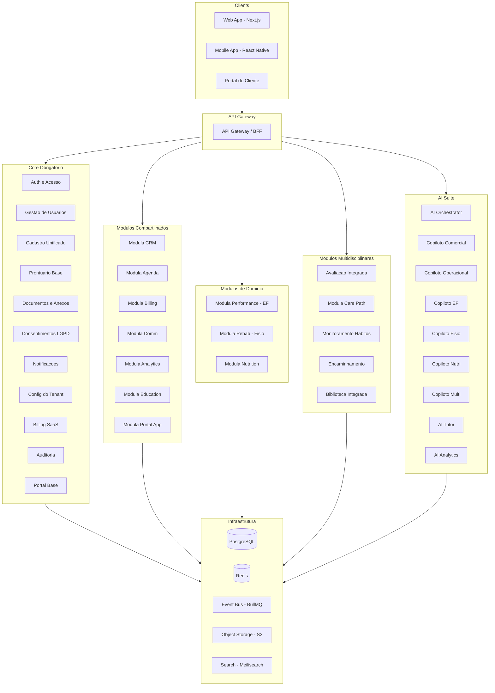
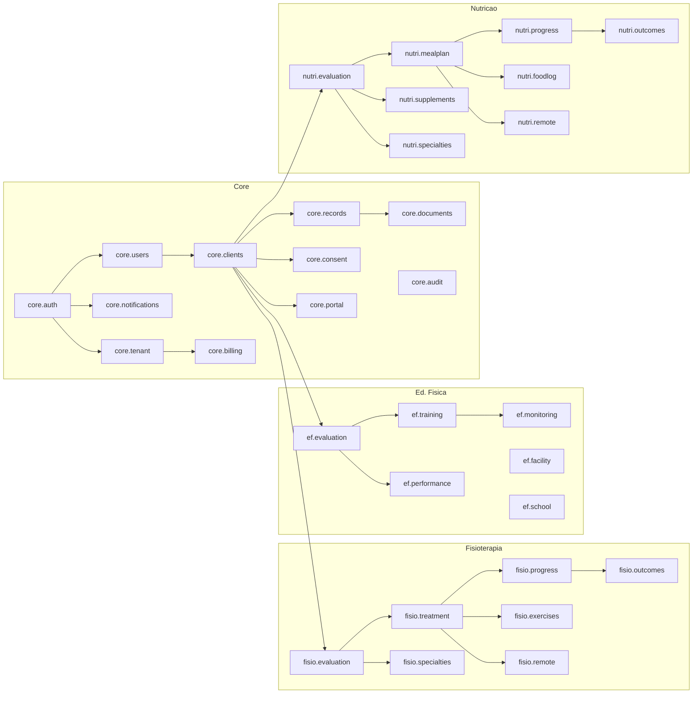
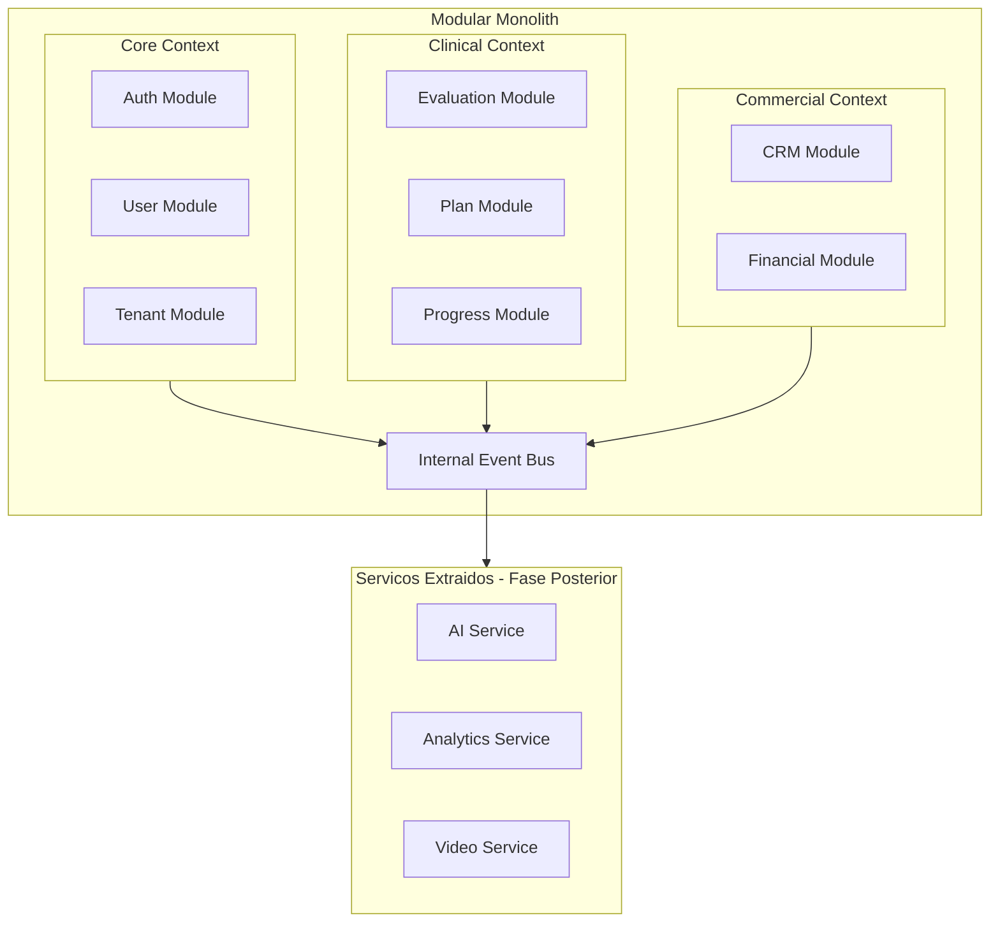

# MODULA HEALTH — Product Architecture

## 1. Diagrama de Arquitetura Geral



---

## 2. Hierarquia de Modulos

### Camadas

| # | Camada | Descricao | Qtd Modulos |
|---|--------|-----------|-------------|
| 1 | Core Obrigatorio | Base para todos os tenants, sempre ativo | 11 |
| 2 | Compartilhados | Funcionalidades cross-domain, compraveis | 7 |
| 3 | Educacao Fisica | Modulos especificos para EF | 6 |
| 4 | Fisioterapia | Modulos especificos para Fisio | 8 |
| 5 | Nutricao | Modulos especificos para Nutricao | 9 |
| 6 | Multidisciplinares | Integracao entre dominios | 5 |
| 7 | AI Suite | Orquestrador + 8 copilotos | 9 |

### Tabela de Dependencias

| Camada | Modulo | Codigo | Obrigatorio | Depende de |
|--------|--------|--------|-------------|------------|
| Core | Auth e Acesso | `core.auth` | Sim | — |
| Core | Gestao de Usuarios | `core.users` | Sim | core.auth |
| Core | Cadastro Unificado | `core.clients` | Sim | core.users |
| Core | Prontuario Base | `core.records` | Sim | core.clients |
| Core | Documentos | `core.documents` | Sim | core.records |
| Core | Consentimentos | `core.consent` | Sim | core.clients |
| Core | Notificacoes | `core.notifications` | Sim | core.auth |
| Core | Config Tenant | `core.tenant` | Sim | core.auth |
| Core | Billing SaaS | `core.billing` | Sim | core.tenant |
| Core | Auditoria | `core.audit` | Sim | — |
| Core | Portal Base | `core.portal` | Sim | core.clients |
| Compartilhado | CRM e Comercial | `mod.crm` | Nao | core |
| Compartilhado | Agenda e Operacao | `mod.agenda` | Nao | core |
| Compartilhado | Financeiro e Cobranca | `mod.financial` | Nao | core |
| Compartilhado | Comunicacao | `mod.communication` | Nao | core |
| Compartilhado | BI e Analytics | `mod.analytics` | Nao | core |
| Compartilhado | Educacao e Estagio | `mod.education` | Nao | core |
| Compartilhado | Portal/App Cliente | `mod.portal` | Nao | core.portal |
| Ed. Fisica | Avaliacao Fisica | `ef.evaluation` | Nao | core |
| Ed. Fisica | Prescricao de Treino | `ef.training` | Nao | ef.evaluation |
| Ed. Fisica | Monitoramento | `ef.monitoring` | Nao | ef.training |
| Ed. Fisica | Performance Esportiva | `ef.performance` | Nao | ef.evaluation |
| Ed. Fisica | Gestao Studio/Academia | `ef.facility` | Nao | mod.agenda |
| Ed. Fisica | Escolar | `ef.school` | Nao | core |
| Fisioterapia | Avaliacao Fisio | `fisio.evaluation` | Nao | core |
| Fisioterapia | Plano Terapeutico | `fisio.treatment` | Nao | fisio.evaluation |
| Fisioterapia | Evolucao Clinica | `fisio.progress` | Nao | fisio.treatment |
| Fisioterapia | Exercicios Terapeuticos | `fisio.exercises` | Nao | fisio.treatment |
| Fisioterapia | Especialidades | `fisio.specialties` | Nao | fisio.evaluation |
| Fisioterapia | Gestao de Clinica | `fisio.clinic` | Nao | mod.agenda |
| Fisioterapia | Telemonitoramento | `fisio.remote` | Nao | fisio.treatment |
| Fisioterapia | Desfechos Clinicos | `fisio.outcomes` | Nao | fisio.progress |
| Nutricao | Avaliacao Nutricional | `nutri.evaluation` | Nao | core |
| Nutricao | Plano Alimentar | `nutri.mealplan` | Nao | nutri.evaluation |
| Nutricao | Evolucao Nutricional | `nutri.progress` | Nao | nutri.mealplan |
| Nutricao | Diario Alimentar | `nutri.foodlog` | Nao | nutri.mealplan |
| Nutricao | Suplementacao | `nutri.supplements` | Nao | nutri.evaluation |
| Nutricao | Especialidades Nutri | `nutri.specialties` | Nao | nutri.evaluation |
| Nutricao | Teleatendimento | `nutri.remote` | Nao | nutri.mealplan |
| Nutricao | Desfechos Nutricionais | `nutri.outcomes` | Nao | nutri.progress |
| Nutricao | Gestao Consultorio | `nutri.office` | Nao | mod.agenda |
| Multi | Avaliacao Integrada | `multi.evaluation` | Nao | 2+ evals |
| Multi | Plano Integrado | `multi.careplan` | Nao | multi.evaluation |
| Multi | Habitos e Adesao | `multi.habits` | Nao | core |
| Multi | Encaminhamento | `multi.referral` | Nao | core |
| Multi | Biblioteca Integrada | `multi.library` | Nao | core |
| AI | AI Suite | `ai.suite` | Nao | core |
| AI | AI Copilotos (cada) | `ai.copilot.*` | Nao | ai.suite + modulo |

---

## 3. Grafo de Dependencias



---

## 4. Modular Monolith — Regras de Modularidade



### Regras

1. Cada modulo expoe **interfaces publicas** (ports) e esconde implementacao
2. Modulos so se comunicam via interfaces ou eventos — nunca acessam internals de outro modulo
3. Cada modulo tem seu proprio diretorio de migracao e seed
4. Cada modulo declara suas dependencias de outros modulos
5. Feature flags controlam ativacao em runtime

### Comunicacao entre Modulos

| Tipo | Mecanismo | Uso |
|------|-----------|-----|
| Sincrona | Interfaces de modulo (ports/contracts) | Chamadas diretas entre modulos no mesmo processo |
| Assincrona | Event bus (BullMQ/Redis Streams) | Eventos de dominio, side-effects |
| Dados | Queries via interfaces compartilhadas | Leitura de dados de outros modulos |

### Eventos Chave do Sistema

| Evento | Origem | Consumidores |
|--------|--------|-------------|
| `ClientCreated` | core.clients | mod.crm, core.consent, core.notifications |
| `EvaluationCompleted` | ef/fisio/nutri.evaluation | core.records, multi.evaluation, ai.copilots |
| `SessionScheduled` | mod.agenda | core.notifications, mod.communication |
| `PaymentReceived` | mod.financial | core.notifications, mod.crm, core.audit |
| `PlanActivated` | ef/fisio/nutri plans | core.portal, mod.portal |
| `ReferralCreated` | multi.referral | core.notifications, core.records |
| `ModuleActivated` | core.billing | core.tenant, UI adaptation |
| `LeadConverted` | mod.crm | core.clients |
| `ContractSigned` | mod.crm | mod.financial |

---

## 5. Bundles Comerciais

| Bundle | Modulos Inclusos |
|--------|-----------------|
| **Starter Personal** | Core + mod.agenda + ef.evaluation + ef.training |
| **Starter Fisio** | Core + mod.agenda + fisio.evaluation + fisio.treatment + fisio.progress |
| **Starter Nutri** | Core + mod.agenda + nutri.evaluation + nutri.mealplan + nutri.progress |
| **Pro Personal** | Starter Personal + mod.crm + mod.financial + ef.monitoring + mod.portal |
| **Pro Fisio** | Starter Fisio + mod.crm + mod.financial + fisio.exercises + fisio.outcomes + mod.portal |
| **Pro Nutri** | Starter Nutri + mod.crm + mod.financial + nutri.foodlog + nutri.outcomes + mod.portal |
| **Studio/Academia** | Pro Personal + ef.facility + mod.communication + mod.analytics |
| **Clinica Fisio** | Pro Fisio + fisio.clinic + fisio.specialties + mod.communication + mod.analytics |
| **Consultorio Nutri** | Pro Nutri + nutri.office + nutri.specialties + mod.communication + mod.analytics |
| **Enterprise Multi** | Todos os modulos + multi.* + ai.suite + mod.analytics |
| **Academico** | Core + mod.education + modulos de avaliacao por area |

---

## 6. Shared vs Specific Capabilities

### Entidades Compartilhadas (Core)

```
Client/Patient/Student  -> UNICA entidade com roles
Evaluation (base)       -> Campos comuns: data, profissional, cliente, status, notas
Plan (base)             -> Campos comuns: objetivos, fases, status, responsavel
ProgressNote (base)     -> Campos comuns: data, sessao, notas, profissional
Session (base)          -> Campos comuns: data, hora, profissional, cliente, status
Exercise (base)         -> Campos comuns: nome, descricao, video, instrucoes
```

### Extensoes por Profissao

```
PhysicalEvaluation extends Evaluation     -> composicao corporal, testes fisicos, VO2
PhysioEvaluation extends Evaluation       -> ADM, forca muscular, testes ortopedicos, escalas
NutritionEvaluation extends Evaluation    -> recordatorio, antropometria, exames lab

TrainingPlan extends Plan                 -> series, repeticoes, carga, periodizacao
TherapeuticPlan extends Plan              -> condutas, recursos terapeuticos, metas funcionais
NutritionPlan extends Plan                -> refeicoes, macros, equivalencias, substituicoes
```

### Estrategia de Extensao

Usar **JSON Schema extensions** em campos `metadata JSONB` para dados especificos de cada profissao, mantendo a tabela base compartilhada:

```
evaluations (tabela base)
  + id, tenant_id, client_id, professional_id, type, status, date, notes, metadata JSONB
  + type discrimina: 'physical' | 'physio' | 'nutrition' | 'integrated'
  + metadata contem campos especificos validados por JSON Schema no application layer
```

**Beneficios**:
- Evita duplicacao de schema
- Permite extensoes sem migracao de banco
- Queries compartilhadas para dados comuns
- Indices parciais por type para performance
