# MODULA HEALTH — Domain Model

## 1. Bounded Contexts

```mermaid
graph LR
    subgraph identity [Identity and Access]
        Tenant
        Company
        Unit
        User
        Role
        Permission
    end

    subgraph people [People Management]
        ProfessionalProfile
        StudentProfile
        ClientProfile
    end

    subgraph commercial [Commercial]
        Lead
        Contact
        Pipeline
        Proposal
        ContractC[Contract]
        Campaign
    end

    subgraph scheduling [Scheduling]
        Appointment
        SessionS[Session]
        Resource
        WaitList
    end

    subgraph clinical [Clinical Core]
        Evaluation
        Plan
        ProgressNote
        Outcome
        Referral
    end

    subgraph content [Content and Library]
        Exercise
        Protocol
        Material
        CourseC[Course]
    end

    subgraph financial [Financial]
        Payment
        Subscription
        Invoice
        Commission
    end

    subgraph engagement [Engagement]
        HabitLog
        FoodLog
        Notification
        Message
    end

    subgraph platform [Platform]
        AuditLog
        FeatureFlag
        AIInsight
        InternshipRecord
    end

    identity --> people
    people --> commercial
    people --> scheduling
    people --> clinical
    scheduling --> clinical
    clinical --> content
    clinical --> engagement
    people --> financial
    scheduling --> financial
    clinical --> platform
```



---

## 2. Mapa de Bounded Contexts

| Bounded Context | Modulos | Responsabilidade |
|----------------|---------|-----------------|
| **Identity & Access** | core.auth, core.users, core.tenant | Autenticacao, autorizacao, tenants, empresas, unidades |
| **People** | core.clients, ProfessionalProfile, StudentProfile | Cadastro de pessoas e perfis |
| **Clinical Core** | core.records, core.documents, core.consent | Prontuario base, documentos, consentimentos |
| **Commercial** | mod.crm | Leads, funil, propostas, contratos |
| **Scheduling** | mod.agenda | Agenda, sessoes, recursos, presenca |
| **Financial** | mod.financial, core.billing | Cobrancas, pagamentos, repasses, assinaturas SaaS |
| **Communication** | mod.communication, core.notifications | Mensagens, campanhas, notificacoes |
| **Analytics** | mod.analytics | Dashboards, metricas, relatorios |
| **Education** | mod.education | Cursos, estagios, supervisao |
| **Fitness Domain** | ef.* | Avaliacao fisica, treino, performance, studio |
| **Physio Domain** | fisio.* | Avaliacao fisio, tratamento, evolucao clinica |
| **Nutrition Domain** | nutri.* | Avaliacao nutricional, plano alimentar, diario |
| **Multidisciplinary** | multi.* | Integracoes entre dominios, care path |
| **AI** | ai.* | Orquestracao de IA, copilotos, insights |
| **Platform** | core.audit, feature flags | Auditoria, observabilidade, feature management |

---

## 3. Comunicacao entre Contexts

### Mecanismos

| Tipo | Mecanismo | Quando Usar |
|------|-----------|-------------|
| **Sincrona** | Interfaces de modulo (module contracts/ports) | Leitura de dados de outros modulos, operacoes que requerem resposta imediata |
| **Assincrona** | Eventos de dominio via event bus (BullMQ/Redis) | Side-effects, notificacoes, atualizacoes de cache, propagacao de estados |

### Catalogo de Eventos de Dominio

#### Identity & Access
| Evento | Produtor | Consumidores |
|--------|----------|-------------|
| `TenantCreated` | core.tenant | core.auth (provisionar owner), core.billing |
| `TenantUpdated` | core.tenant | cache invalidation |
| `UnitCreated` | core.tenant | core.users |
| `UserLoggedIn` | core.auth | core.audit |
| `UserActivated` | core.auth | core.users |
| `UserCreated` | core.users | mod.education (se estudante) |
| `RoleAssigned` | core.users | core.audit |

#### People
| Evento | Produtor | Consumidores |
|--------|----------|-------------|
| `ClientCreated` | core.clients | core.consent, mod.crm, core.notifications |
| `ClientStatusChanged` | core.clients | mod.communication (reativacao) |
| `ClientLinkedToProfessional` | core.clients | core.records |
| `ClientMerged` | core.clients | todos os modulos clinicos |

#### Commercial
| Evento | Produtor | Consumidores |
|--------|----------|-------------|
| `LeadCreated` | mod.crm | ai.copilot.commercial |
| `LeadStageChanged` | mod.crm | core.notifications |
| `LeadConverted` | mod.crm | core.clients |
| `ProposalAccepted` | mod.crm | mod.financial |
| `ContractSigned` | mod.crm | mod.financial, core.documents |

#### Scheduling
| Evento | Produtor | Consumidores |
|--------|----------|-------------|
| `AppointmentScheduled` | mod.agenda | core.notifications, mod.communication, core.audit |
| `AppointmentConfirmed` | mod.agenda | core.notifications |
| `AppointmentCancelled` | mod.agenda | mod.financial, core.notifications |
| `NoShowMarked` | mod.agenda | ai.copilot.ops, mod.communication |
| `CheckInCompleted` | mod.agenda | ef.facility, core.audit |
| `SessionCompleted` | mod.agenda | core.records, mod.financial, core.audit |

#### Clinical
| Evento | Produtor | Consumidores |
|--------|----------|-------------|
| `PhysicalEvaluationCompleted` | ef.evaluation | core.records, ef.training, ai.copilot.ef, multi.evaluation |
| `PhysioEvaluationCompleted` | fisio.evaluation | core.records, fisio.treatment, ai.copilot.fisio, multi.evaluation |
| `NutritionEvaluationCompleted` | nutri.evaluation | core.records, nutri.mealplan, ai.copilot.nutri, multi.evaluation |
| `TrainingPrescribed` | ef.training | mod.portal, core.records |
| `TreatmentPlanCreated` | fisio.treatment | fisio.exercises, core.records |
| `MealPlanCreated` | nutri.mealplan | mod.portal, core.records |
| `ProgressNoteCreated` | fisio.progress | core.records, fisio.outcomes |
| `ReferralCreated` | multi.referral | core.notifications, core.records |

#### Financial
| Evento | Produtor | Consumidores |
|--------|----------|-------------|
| `PaymentCreated` | mod.financial | core.notifications |
| `PaymentReceived` | mod.financial | mod.agenda, core.notifications, mod.crm, core.audit |
| `PaymentOverdue` | mod.financial | mod.communication, core.notifications |
| `CommissionCalculated` | mod.financial | core.notifications |

#### Engagement
| Evento | Produtor | Consumidores |
|--------|----------|-------------|
| `TrainingLogged` | mod.portal | ef.monitoring, ef.training |
| `FoodLogCreated` | mod.portal | nutri.foodlog, ai.copilot.nutri |
| `CheckInCompleted` | mod.portal | multi.habits, ef.monitoring, nutri.progress |
| `HabitLogged` | multi.habits | multi.habits (streaks) |

#### Platform / Billing
| Evento | Produtor | Consumidores |
|--------|----------|-------------|
| `ModuleActivated` | core.billing | core.tenant, UI adaptation, feature flags |
| `ModuleDeactivated` | core.billing | core.tenant, UI adaptation |
| `TrialStarted` | core.billing | core.notifications |
| `TrialExpired` | core.billing | core.notifications, core.tenant |
| `SaaSPaymentFailed` | core.billing | core.notifications |

---

## 4. Entidades Centrais e Relacoes

### Diagrama de Entidades Core

```
┌─────────────────────────────────────────────────┐
│                    TENANT                        │
│  id, name, slug, plan, status, branding JSONB    │
├────────────────────┬────────────────────────────┘
│                    │ 1:N
│               ┌────▼─────┐
│               │ COMPANY  │
│               │ id, name,│
│               │ cnpj     │
│               ├────┬─────┘
│               │    │ 1:N
│               │ ┌──▼───┐
│               │ │ UNIT │
│               │ │ id,  │
│               │ │ name,│
│               │ │ addr │
│               │ └──┬───┘
│               │    │ N:N (via UnitMembership)
└───────────────┘    │
                  ┌──▼──────────────────┐
                  │        USER          │
                  │  id, email, status   │
                  ├──────────────────────┤
                  │ 1:1 AuthCredential   │
                  │ 1:N Roles            │
                  │ 1:N UnitMemberships  │
                  │ 0:1 ProfessionalProf │
                  │ 0:1 StudentProfile   │
                  └──────┬───────────────┘
                         │ N:N (via ClientProfessionalLink)
                  ┌──────▼───────────────┐
                  │    CLIENT_PROFILE     │
                  │  id, name, cpf,       │
                  │  status, tags JSONB   │
                  ├───────────────────────┤
                  │ 1:N Evaluations       │
                  │ 1:N Plans             │
                  │ 1:N Sessions          │
                  │ 1:N ProgressNotes     │
                  │ 1:N Documents         │
                  │ 1:N Consents          │
                  │ 1:N Referrals         │
                  └───────────────────────┘
```

### Hierarquia de Tenant

```
Tenant (conta SaaS)
  └── Company (empresa/grupo)
       └── Unit (unidade/filial)
            └── UnitMembership (usuario + role na unidade)
```

### Entidade Base: Evaluation

```
┌─────────────────────────────────────────────────────────────┐
│                     EVALUATIONS (base)                       │
├─────────────────────────────────────────────────────────────┤
│  id          UUID PK                                         │
│  tenant_id   UUID FK → tenants (RLS)                         │
│  unit_id     UUID FK → units                                 │
│  client_id   UUID FK → client_profiles                       │
│  professional_id UUID FK → users                             │
│  type        VARCHAR(50)  -- 'physical'|'physio'|'nutrition' │
│  status      VARCHAR(30)  -- 'draft'|'scheduled'|'completed' │
│  scheduled_at TIMESTAMPTZ                                    │
│  completed_at TIMESTAMPTZ                                    │
│  notes       TEXT                                            │
│  metadata    JSONB  -- campos especificos por type           │
│  created_at  TIMESTAMPTZ                                     │
│  updated_at  TIMESTAMPTZ                                     │
│  created_by  UUID FK → users                                 │
│  version     INTEGER                                         │
└─────────────────────────────────────────────────────────────┘
                              │
              ┌───────────────┼───────────────────┐
              │               │                   │
     ┌────────▼──────┐  ┌────▼────────┐  ┌──────▼─────────┐
     │ type=physical  │  │ type=physio  │  │ type=nutrition  │
     │ metadata:      │  │ metadata:    │  │ metadata:       │
     │  bodyComp,     │  │  painMap,    │  │  foodRecall,    │
     │  skinFolds,    │  │  rom,        │  │  allergies,     │
     │  funcTests,    │  │  muscleStr,  │  │  labExams,      │
     │  cardioTests   │  │  orthoTests, │  │  anthropometry  │
     │               │  │  clinScales  │  │                 │
     └───────────────┘  └─────────────┘  └─────────────────┘
```

### Relacionamentos Chave

```
Tenant         → has many → Companies → has many → Units
User           → belongs to many → Units (via UnitMembership with role)
User           → has one  → ProfessionalProfile (optional)
User           → has one  → StudentProfile (optional)
ClientProfile  → has many → Evaluations (across types)
ClientProfile  → has many → Plans (across types)
ClientProfile  → has many → Sessions (across types)
Evaluation     → belongs to → Professional + Client + Unit
Plan           → belongs to → Professional + Client
Session        → belongs to → Appointment → Professional + Client + Unit
Referral       → from Professional → to Professional (with ClientProfile)
```

---

## 5. Regra de Extensao via JSONB

### Principio

Tabelas base compartilhadas com coluna `type` (discriminator) + campo `metadata JSONB` para dados especificos. O application layer valida via JSON Schema por type.

### Schema SQL

```sql
CREATE TABLE evaluations (
    id UUID PRIMARY KEY DEFAULT gen_random_uuid(),
    tenant_id UUID NOT NULL REFERENCES tenants(id),
    unit_id UUID NOT NULL REFERENCES units(id),
    client_id UUID NOT NULL REFERENCES client_profiles(id),
    professional_id UUID NOT NULL REFERENCES users(id),
    type VARCHAR(50) NOT NULL,
    status VARCHAR(30) NOT NULL DEFAULT 'draft',
    scheduled_at TIMESTAMPTZ,
    completed_at TIMESTAMPTZ,
    notes TEXT,
    metadata JSONB NOT NULL DEFAULT '{}',
    created_at TIMESTAMPTZ NOT NULL DEFAULT NOW(),
    updated_at TIMESTAMPTZ NOT NULL DEFAULT NOW(),
    created_by UUID NOT NULL REFERENCES users(id),
    version INTEGER NOT NULL DEFAULT 1
);

ALTER TABLE evaluations ENABLE ROW LEVEL SECURITY;
CREATE POLICY tenant_isolation ON evaluations
    USING (tenant_id = current_setting('app.current_tenant')::UUID);

CREATE INDEX idx_evaluations_physical ON evaluations(client_id, completed_at)
    WHERE type = 'physical';
CREATE INDEX idx_evaluations_physio ON evaluations(client_id, completed_at)
    WHERE type = 'physio';
CREATE INDEX idx_evaluations_nutrition ON evaluations(client_id, completed_at)
    WHERE type = 'nutrition';
CREATE INDEX idx_evaluations_metadata ON evaluations USING GIN (metadata);
```

### JSON Schema por Type (Application Layer)

```typescript
const evaluationSchemas: Record<string, JSONSchema> = {
  physical: {
    type: 'object',
    properties: {
      bodyComposition: {
        type: 'object',
        properties: {
          weight: { type: 'number' },
          height: { type: 'number' },
          bmi: { type: 'number' },
          bodyFatPercentage: { type: 'number' },
          leanMass: { type: 'number' },
        },
      },
      skinFolds: {
        type: 'object',
        properties: {
          protocol: { type: 'string', enum: ['pollock3', 'pollock7', 'guedes'] },
          measurements: { type: 'object' },
        },
      },
      functionalTests: { type: 'array', items: { $ref: '#/definitions/FunctionalTest' } },
      strengthTests: { type: 'array', items: { $ref: '#/definitions/StrengthTest' } },
      cardioTests: { type: 'array', items: { $ref: '#/definitions/CardioTest' } },
    },
  },
  physio: {
    type: 'object',
    properties: {
      painAssessment: {
        type: 'object',
        properties: {
          vas: { type: 'number', minimum: 0, maximum: 10 },
          location: { type: 'array', items: { type: 'string' } },
          aggravatingFactors: { type: 'array', items: { type: 'string' } },
          relievingFactors: { type: 'array', items: { type: 'string' } },
        },
      },
      romAssessments: { type: 'array', items: { $ref: '#/definitions/ROMAssessment' } },
      muscleStrength: { type: 'array', items: { $ref: '#/definitions/MuscleStrengthTest' } },
      orthopedicTests: { type: 'array', items: { $ref: '#/definitions/OrthopedicTest' } },
      clinicalScales: { type: 'array', items: { $ref: '#/definitions/ClinicalScale' } },
      redFlags: { type: 'array', items: { type: 'string' } },
    },
  },
  nutrition: {
    type: 'object',
    properties: {
      foodRecall: { $ref: '#/definitions/FoodRecall' },
      allergies: { type: 'array', items: { type: 'string' } },
      intolerances: { type: 'array', items: { type: 'string' } },
      labExams: { type: 'array', items: { $ref: '#/definitions/LabExam' } },
      anthropometry: { $ref: '#/definitions/Anthropometry' },
      symptoms: { type: 'array', items: { type: 'string' } },
      currentSupplements: { type: 'array', items: { type: 'string' } },
    },
  },
};
```

### Beneficios

1. **Sem duplicacao de schema** — tabela base unica compartilhada
2. **Sem migracao para extensoes** — novos campos adicionados via JSON Schema
3. **Queries compartilhadas** — consultas por client/date/professional funcionam igual para todos os types
4. **Performance** — indices parciais por type, indice GIN para queries em metadata
5. **Flexibilidade** — cada tenant pode ter campos customizados adicionais

### Consideracoes

- **Validacao no app layer** — PostgreSQL nao valida JSON Schema nativamente; usar Zod/AJV no NestJS
- **Queries complexas em JSONB** — para queries frequentes, criar indices GIN especificos ou materialized views
- **Migrations de schema** — ao mudar o JSON Schema, rodar migration de dados para adaptar registros existentes

---

## 6. Inventario de Entidades por Bounded Context

### Identity & Access (~15 entidades)
- Tenant, Company, Unit, TenantBranding, TenantPolicy, TenantTemplate
- User, AuthCredential, Session, MFAConfig, Invitation, PasswordResetToken
- Role, Permission, UnitMembership

### People (~10 entidades)
- ClientProfile, ClientContact, Guardian, EmergencyContact
- ClientDocument, ClientAddress, ClientTag, ClientProfessionalLink
- ProfessionalProfile, StudentProfile, ProfessionRegistration

### Clinical Core (~10 entidades)
- MedicalRecord, TimelineEvent, RecordEntry, RecordVersion
- Document, DocumentVersion, DocumentCategory
- ConsentTemplate, ConsentRecord, ConsentRevocation

### Commercial (~12 entidades)
- Lead, Pipeline, PipelineStage, LeadInteraction
- FollowUpTask, Proposal, Contract, Campaign
- LeadSource, LeadTag

### Scheduling (~10 entidades)
- Appointment, Session, RecurrenceRule, TimeSlot
- WaitListEntry, CheckIn, Room, Resource
- ScheduleBlock, GroupClass

### Financial (~15 entidades)
- Payment, Invoice, Subscription, Plan, Package
- Commission, Discount, Coupon, Credit, Refund
- CashFlowEntry, Receipt, SaaSSubscription, SaaSPlan, SaaSInvoice

### Clinical Domain (~40 entidades)
- Evaluation (base) + PhysicalEvaluation, PhysioEvaluation, NutritionEvaluation
- Plan (base) + TrainingPlan, TherapeuticPlan, NutritionPlan
- ProgressNote (base) + FitnessProgress, ClinicalProgress, NutritionProgress
- Exercise libraries, templates, feedback entities

### Engagement (~15 entidades)
- HabitLog, SleepLog, PainLog, StressLog, MoodLog, WaterLog
- FoodLog, FoodLogEntry, FoodPhoto
- AdherenceScore, HabitStreak, ClientGoal

### Platform (~10 entidades)
- AuditLog, AuditEntry, AuditAlert
- FeatureFlag, ModuleEntitlement, Trial
- AIRequest, AIResponse, AIFeedback, AIQuota

**Total estimado: ~120+ entidades de dominio**

---

## 7. Regras de Negocio Criticas

### Multi-tenancy
- `tenant_id` obrigatorio em TODAS as tabelas de dados
- RLS no PostgreSQL para garantir isolamento
- Nunca query sem filtro de tenant

### Dados Sensiveis
- Campos `sensitive = true` no schema
- Acesso logado em audit trail separado
- Criptografia at-rest para campos criticos
- Mascara em exports nao autorizados

### Soft-Lock em Desativacao
- Modulo desativado → dados permanecem no banco
- UI oculta, API retorna 403
- Reativacao → dados imediatamente acessiveis
- Nunca DELETE de dados por desativacao

### Versionamento de Registros Clinicos
- `version` integer em registros clinicos
- Cada alteracao cria nova versao
- Versao anterior preservada (imutabilidade)
- Audit trail de quem alterou e quando

### Extensao via JSONB
- Validacao obrigatoria no app layer via JSON Schema
- Indices GIN para queries em metadata
- Indices parciais por type para performance
- Migrations de dados quando schema evolui
