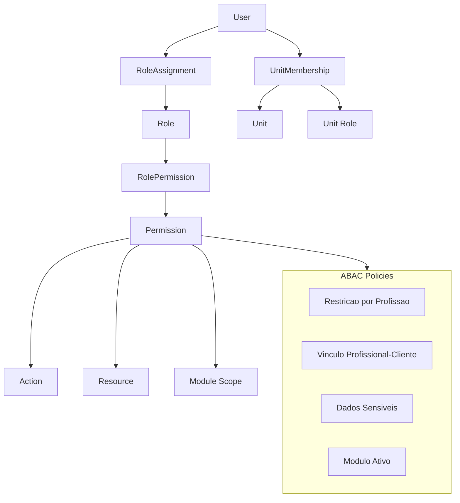
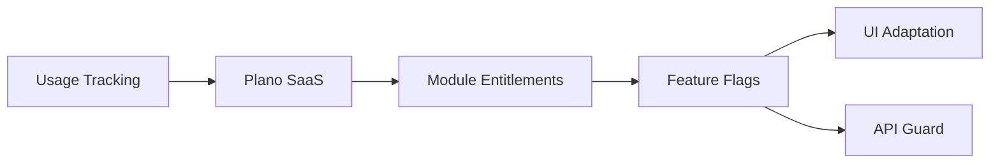

# MODULA HEALTH — Permissions, Security & Multi-tenant

## 1. Modelo Hibrido RBAC + ABAC



---

## 2. Camadas de Permissao

A autorizacao do MODULA HEALTH opera em 7 camadas hierarquicas. Cada request precisa passar por TODAS as camadas aplicaveis:

### Camada 1: Modulo Ativo (Feature Flag)

O modulo precisa estar ativo para o tenant. Se o modulo nao esta no plano ou trial, a API retorna 403.

```typescript
@UseGuards(ModuleGuard('ef.training'))
@Controller('ef/training-plans')
export class TrainingPlanController {}
```

### Camada 2: Role (RBAC)

| Role | Descricao | Nivel |
|------|-----------|-------|
| `platform_admin` | Admin da plataforma (Modula Health) | Sistema |
| `owner` | Dono do tenant | Tenant |
| `admin` | Administrador do tenant | Tenant |
| `manager` | Gestor de unidade(s) | Unidade |
| `professional` | Profissional (EF, Fisio, Nutri) | Unidade |
| `intern` | Estagiario/estudante | Unidade |
| `reception` | Recepcionista | Unidade |
| `student` | Estudante (mod.education) | Tenant |
| `client` | Cliente/paciente/aluno | Tenant |

### Camada 3: Profession Scope

Profissionais sao vinculados a uma profissao que restringe acesso a modulos da area:

| Profissao | Registro | Modulos Acessiveis |
|-----------|----------|-------------------|
| Educacao Fisica | CREF | ef.* |
| Fisioterapia | CREFITO | fisio.* |
| Nutricao | CRN | nutri.* |

Modulos compartilhados (mod.*, multi.*) sao acessiveis por todas as profissoes. Um profissional com multiplos registros acessa modulos de multiplas areas.

### Camada 4: Unit Scope

Profissional so ve dados da(s) unidade(s) vinculada(s), exceto gestores com permissao cross-unit.

```typescript
// Filtro automatico por unidade
const evaluations = await db
  .select()
  .from(evaluations)
  .where(
    and(
      eq(evaluations.unitId, currentUser.activeUnitId),
      // RLS ja filtra por tenant_id automaticamente
    )
  );
```

### Camada 5: Client Binding

Profissional so ve clientes vinculados a ele (via `ClientProfessionalLink`), exceto:
- Gestores veem todos os clientes da unidade
- Admins/owners veem todos os clientes do tenant
- Encaminhamentos criam vinculo temporario de leitura

```typescript
// Verificacao de vinculo
const hasAccess = await clientService.isProfessionalLinked(
  currentUser.id,
  clientId
);
```

### Camada 6: Sensitive Data

Dados marcados como `sensitive = true` requerem permissao explicita:

| Nivel | Dados | Acesso |
|-------|-------|--------|
| 1 (Baixo) | Operacionais, agenda, exercicios | Todos os profissionais vinculados |
| 2 (Medio) | Dados pessoais, avaliacao fisica, composicao corporal | Profissional vinculado + gestor |
| 3 (Alto) | Dados clinicos, diagnosticos, medicamentos, evolucao | Profissional responsavel + autorizado |
| 4 (Critico) | Dados psicologicos, laudos, informacoes judiciais | Apenas profissional responsavel + consentimento explicito |

```typescript
@UseSensitiveDataGuard({ level: 3 })
@Get('clients/:id/clinical-records')
async getClinicalRecords(@Param('id') clientId: string) {}
```

### Camada 7: Action

Acoes granulares por recurso:

| Acao | Descricao |
|------|-----------|
| `create` | Criar registro |
| `read` | Ler registro |
| `update` | Atualizar registro |
| `delete` | Deletar registro (soft delete) |
| `export` | Exportar dados (PDF, CSV) |
| `share` | Compartilhar com outro profissional |
| `sign` | Assinar digitalmente |

---

## 3. Schema de Permissoes

### Tabelas

```sql
CREATE TABLE roles (
    id UUID PRIMARY KEY DEFAULT gen_random_uuid(),
    tenant_id UUID REFERENCES tenants(id),
    name VARCHAR(50) NOT NULL,
    is_system BOOLEAN DEFAULT false, -- roles padrao do sistema
    permissions JSONB NOT NULL DEFAULT '[]',
    created_at TIMESTAMPTZ DEFAULT NOW()
);

CREATE TABLE role_permissions (
    id UUID PRIMARY KEY DEFAULT gen_random_uuid(),
    role_id UUID NOT NULL REFERENCES roles(id),
    module_code VARCHAR(50) NOT NULL,    -- 'ef.training', 'mod.crm'
    resource VARCHAR(50) NOT NULL,        -- 'training_plans', 'leads'
    actions TEXT[] NOT NULL,              -- '{create,read,update}'
    conditions JSONB DEFAULT '{}',        -- ABAC conditions
    created_at TIMESTAMPTZ DEFAULT NOW()
);

CREATE TABLE user_roles (
    id UUID PRIMARY KEY DEFAULT gen_random_uuid(),
    user_id UUID NOT NULL REFERENCES users(id),
    role_id UUID NOT NULL REFERENCES roles(id),
    unit_id UUID REFERENCES units(id),    -- NULL = tenant-wide
    granted_by UUID REFERENCES users(id),
    granted_at TIMESTAMPTZ DEFAULT NOW(),
    UNIQUE(user_id, role_id, unit_id)
);

CREATE TABLE unit_memberships (
    id UUID PRIMARY KEY DEFAULT gen_random_uuid(),
    user_id UUID NOT NULL REFERENCES users(id),
    unit_id UUID NOT NULL REFERENCES units(id),
    role VARCHAR(50) NOT NULL,
    profession VARCHAR(20),               -- 'ef', 'physio', 'nutrition'
    profession_registration VARCHAR(50),  -- 'CREF 012345-G/SP'
    is_active BOOLEAN DEFAULT true,
    joined_at TIMESTAMPTZ DEFAULT NOW(),
    UNIQUE(user_id, unit_id)
);
```

### Permission Check Pipeline

```typescript
@Injectable()
export class PermissionGuard implements CanActivate {
  async canActivate(context: ExecutionContext): Promise<boolean> {
    const request = context.switchToHttp().getRequest();
    const user = request.user;
    const requiredPermission = this.reflector.get('permission', context.getHandler());

    // Camada 1: Modulo ativo?
    if (!await this.featureService.isModuleActive(user.tenantId, requiredPermission.module)) {
      throw new ForbiddenException('Module not active');
    }

    // Camada 2: Role tem permissao?
    const userRoles = await this.roleService.getUserRoles(user.id, user.activeUnitId);
    const hasRolePermission = userRoles.some(role =>
      this.roleService.hasPermission(role, requiredPermission)
    );
    if (!hasRolePermission) throw new ForbiddenException('Insufficient role permissions');

    // Camada 3: Profissao compativel?
    if (requiredPermission.professionRequired) {
      const hasProfession = user.professions.includes(requiredPermission.professionRequired);
      if (!hasProfession) throw new ForbiddenException('Profession mismatch');
    }

    // Camada 4: Unidade correta?
    if (requiredPermission.unitScoped && !user.isManager) {
      const inUnit = user.unitIds.includes(requiredPermission.unitId);
      if (!inUnit) throw new ForbiddenException('Unit access denied');
    }

    // Camada 5: Vinculo com cliente?
    if (requiredPermission.clientId && !user.isManager) {
      const isLinked = await this.clientService.isProfessionalLinked(
        user.id, requiredPermission.clientId
      );
      if (!isLinked) throw new ForbiddenException('Client not linked');
    }

    // Camada 6: Dado sensivel?
    if (requiredPermission.sensitivityLevel) {
      const canAccess = await this.sensitiveDataService.checkAccess(
        user, requiredPermission.sensitivityLevel
      );
      if (!canAccess) throw new ForbiddenException('Sensitive data access denied');
      await this.auditService.logSensitiveAccess(user, requiredPermission);
    }

    return true;
  }
}
```

---

## 4. Multi-tenant Strategy

### 4.1 Hierarquia

```
Tenant (conta SaaS — unidade de billing e isolamento)
  └── Company (empresa/grupo juridico)
       └── Unit (unidade/filial — local fisico)
            └── UnitMembership (usuario + role + profissao)
```

### 4.2 Regras de Isolamento

| Dado | Escopo de Isolamento | Mecanismo |
|------|---------------------|-----------|
| Todos os dados de negocio | Tenant | RLS com `tenant_id` |
| Agenda, sessoes, presenca | Unit | Filtro por `unit_id` |
| Clientes de um profissional | Client binding | `ClientProfessionalLink` |
| Dados sensiveis | Permissao explicita | `sensitive_data_access` |

### 4.3 Usuarios Multi-unidade

```typescript
// Um usuario pode pertencer a multiplas unidades com roles diferentes
const memberships = [
  { userId: 'user-1', unitId: 'unit-sp', role: 'professional', profession: 'ef' },
  { userId: 'user-1', unitId: 'unit-rj', role: 'manager', profession: 'ef' },
];

// No login, seleciona unidade ativa
// Na UI, pode trocar de unidade (context switch)
```

### 4.4 Configuracao em Cascata

```
Tenant Config (defaults)
  └── Company Config (override)
       └── Unit Config (override local)
```

Configuracoes de horario, politicas de cancelamento, branding, etc., seguem heranca com override.

### 4.5 White-label Futuro

- `Tenant.branding`: logo, cores, favicon, dominio
- CSS variables por tenant carregadas no runtime
- Subdominios: `{slug}.modulahealth.com.br`
- Dominio proprio via CNAME
- Todas as referencias a marca via config, nunca hardcoded

---

## 5. Billing e Feature Activation

### 5.1 Modelo de Ativacao



### 5.2 Regras

| Cenario | Comportamento |
|---------|--------------|
| **Core** | Sempre ativo em qualquer plano |
| **Modulo no plano** | Flag `active = true` |
| **Modulo em trial** | Flag `active = true` + `trial_expires_at` |
| **Trial expirado** | Flag `active = false`, dados retidos |
| **Downgrade** | Flag `active = false`, dados retidos (soft-lock), UI oculta |
| **Reativacao** | Flag `active = true`, dados imediatamente acessiveis |
| **Bundle** | Conjunto de flags individuais ativadas |
| **Add-on** | Flag + billing separado (ex: AI Suite) |

### 5.3 Feature Flag Implementation

```typescript
@Injectable()
export class FeatureService {
  constructor(
    private readonly redis: RedisService,
    private readonly db: DatabaseService,
  ) {}

  async isModuleActive(tenantId: string, moduleCode: string): Promise<boolean> {
    // Check cache first
    const cached = await this.redis.get(`flags:${tenantId}:${moduleCode}`);
    if (cached !== null) return cached === 'true';

    // Query DB
    const entitlement = await this.db
      .select()
      .from(moduleEntitlements)
      .where(
        and(
          eq(moduleEntitlements.tenantId, tenantId),
          eq(moduleEntitlements.moduleCode, moduleCode),
          eq(moduleEntitlements.isActive, true),
        )
      )
      .first();

    // Check trial expiration
    if (entitlement?.trialExpiresAt && new Date() > entitlement.trialExpiresAt) {
      await this.deactivateModule(tenantId, moduleCode);
      return false;
    }

    const isActive = !!entitlement;
    await this.redis.set(`flags:${tenantId}:${moduleCode}`, String(isActive), 'EX', 300);
    return isActive;
  }
}
```

### 5.4 UI Adaptation

```typescript
// Frontend: hook de feature flag
function useModuleActive(moduleCode: string): boolean {
  const { data } = useQuery({
    queryKey: ['module-flags', moduleCode],
    queryFn: () => api.checkModuleActive(moduleCode),
    staleTime: 5 * 60 * 1000, // 5 min
  });
  return data?.active ?? false;
}

// Sidebar navigation
function SideNav() {
  const isEFActive = useModuleActive('ef.training');
  const isCRMActive = useModuleActive('mod.crm');

  return (
    <nav>
      <NavItem href="/clients" label="Clientes" />
      <NavItem href="/agenda" label="Agenda" />
      {isEFActive ? (
        <NavItem href="/ef/training" label="Treinos" />
      ) : (
        <LockedNavItem label="Treinos" onUpgrade={() => openUpgradeModal('ef.training')} />
      )}
      {isCRMActive ? (
        <NavItem href="/crm" label="CRM" />
      ) : (
        <LockedNavItem label="CRM" onUpgrade={() => openUpgradeModal('mod.crm')} />
      )}
    </nav>
  );
}
```

---

## 6. Dados Sensiveis e LGPD

### 6.1 Classificacao

| Nivel | Descricao | Exemplos | Protecao |
|-------|-----------|----------|----------|
| 1 — Baixo | Dados operacionais | Agenda, exercicios, horarios | RLS padrao |
| 2 — Medio | Dados pessoais | Nome, CPF, endereco, avaliacao fisica | RLS + audit |
| 3 — Alto | Dados clinicos | Diagnosticos, medicamentos, evolucao | RLS + audit + criptografia |
| 4 — Critico | Dados ultra-sensiveis | Psicologicos, laudos, judiciais | RLS + audit + criptografia + consentimento |

### 6.2 Protecoes

- **Criptografia at-rest**: Campos de nivel 3-4 criptografados no banco
- **Mascara de dados**: Em exports, campos sensiveis sao mascarados se usuario nao tem permissao
- **Audit trail dedicada**: Acesso a dados de nivel 3-4 logado em tabela separada
- **Consentimento explicito**: Nivel 4 requer consentimento documentado do paciente
- **Retencao**: Dados clinicos retidos por 20 anos (regulacao de saude no Brasil)
- **Direito ao esquecimento**: Anonimizacao de dados pessoais (nivel 1-2) sob solicitacao, mantendo dados clinicos anonimizados

### 6.3 Audit Trail de Dados Sensiveis

```sql
CREATE TABLE sensitive_data_access_log (
    id UUID PRIMARY KEY DEFAULT gen_random_uuid(),
    tenant_id UUID NOT NULL,
    user_id UUID NOT NULL,
    client_id UUID NOT NULL,
    resource_type VARCHAR(50) NOT NULL,
    resource_id UUID NOT NULL,
    sensitivity_level INTEGER NOT NULL,
    action VARCHAR(20) NOT NULL,
    ip_address INET,
    user_agent TEXT,
    accessed_at TIMESTAMPTZ NOT NULL DEFAULT NOW()
);

-- Append-only: sem UPDATE ou DELETE
REVOKE UPDATE, DELETE ON sensitive_data_access_log FROM app_user;
```
