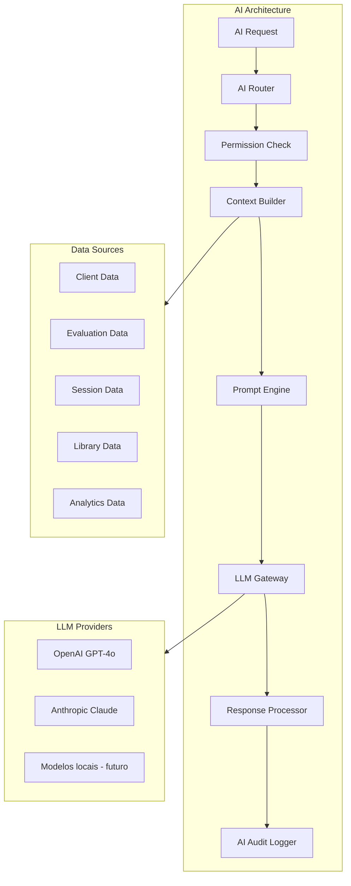

# MODULA HEALTH — AI Architecture

## 1. Visao Geral

A IA no MODULA HEALTH e uma **camada transversal** que opera sobre todos os modulos, fornecendo inteligencia contextual para profissionais, gestores e estudantes. Opera sob principios rigorosos de seguranca, transparencia e responsabilidade.

---

## 2. Arquitetura de Orquestracao



---

## 3. Pipeline de Requisicao

### Fluxo Completo

```
1. AI Request (usuario clica "AI Assist")
   ↓
2. AI Router (identifica copiloto correto)
   ↓
3. Permission Check
   - Usuario tem acesso ao modulo de IA?
   - Quota de requests nao excedida?
   - Dados solicitados estao dentro do escopo de permissao?
   ↓
4. Context Builder
   - Coleta dados relevantes do cliente/caso
   - Filtra dados por nivel de sensibilidade
   - Aplica regras de acesso (so dados que o usuario pode ver)
   - Monta contexto estruturado
   ↓
5. Prompt Engine
   - Seleciona template de prompt por dominio/acao
   - Injeta contexto no prompt
   - Adiciona guardrails e instrucoes de seguranca
   - Adiciona instrucoes de formato de resposta
   ↓
6. LLM Gateway
   - Seleciona provider (OpenAI primary, Anthropic fallback)
   - Seleciona modelo por complexidade/custo
   - Executa request com retry e timeout
   ↓
7. Response Processor
   - Valida formato da resposta
   - Aplica guardrails de output (rejeita conteudo inadequado)
   - Formata para apresentacao
   - Adiciona disclaimers e referencias
   ↓
8. AI Audit Logger
   - Loga prompt, resposta, tokens, custo, latencia
   - Registra tenant_id, user_id, module, action
   - Calcula consumo contra quota
```

---

## 4. Implementacao do Orquestrador

```typescript
@Injectable()
export class AIOrchestrator {
  constructor(
    private readonly router: AIRouter,
    private readonly contextBuilder: ContextBuilder,
    private readonly permissionCheck: AIPermissionCheck,
    private readonly promptEngine: PromptEngine,
    private readonly llmGateway: LLMGateway,
    private readonly responseProcessor: ResponseProcessor,
    private readonly auditLogger: AIAuditLogger,
    private readonly quotaService: AIQuotaService,
  ) {}

  async process(request: AIRequest): Promise<AIResponse> {
    const startTime = Date.now();

    // Permission & quota check
    await this.permissionCheck.verify(request.userId, request.tenantId, 'ai.suite');
    await this.quotaService.checkAndDecrement(request.tenantId, request.userId);

    // Route to correct copilot
    const copilot = this.router.resolve(request.module, request.action);

    // Build context (respecting user permissions)
    const context = await this.contextBuilder.build({
      tenantId: request.tenantId,
      userId: request.userId,
      clientId: request.clientId,
      module: request.module,
      dataScope: copilot.requiredData,
      maxSensitivityLevel: await this.permissionCheck.getMaxSensitivityLevel(request.userId),
    });

    // Generate prompt
    const prompt = this.promptEngine.generate({
      template: copilot.promptTemplate,
      context,
      action: request.action,
      userMessage: request.userMessage,
      guardrails: copilot.guardrails,
    });

    // Call LLM
    const llmResponse = await this.llmGateway.complete({
      messages: prompt.messages,
      model: this.selectModel(request),
      temperature: copilot.temperature ?? 0.3,
      maxTokens: copilot.maxTokens ?? 2000,
    });

    // Process response
    const processedResponse = this.responseProcessor.process({
      rawResponse: llmResponse,
      format: copilot.responseFormat,
      disclaimers: copilot.disclaimers,
    });

    // Audit
    await this.auditLogger.log({
      requestId: request.id,
      tenantId: request.tenantId,
      userId: request.userId,
      module: request.module,
      action: request.action,
      model: llmResponse.model,
      inputTokens: llmResponse.usage.promptTokens,
      outputTokens: llmResponse.usage.completionTokens,
      cost: this.calculateCost(llmResponse),
      latencyMs: Date.now() - startTime,
      status: 'success',
    });

    return processedResponse;
  }

  private selectModel(request: AIRequest): string {
    if (request.preferredModel) return request.preferredModel;
    if (request.complexity === 'high') return 'gpt-4o';
    return 'gpt-4o-mini'; // default: mais barato
  }
}
```

---

## 5. Catalogo de Copilotos

### 5.1 Copiloto de Educacao Fisica (`ai.copilot.ef`)

| Acao | Descricao | Dados Necessarios | Modelo |
|------|-----------|-------------------|--------|
| `suggest-training` | Gerar rascunho de treino | Avaliacao, objetivos, historico | GPT-4o |
| `suggest-progression` | Sugestao de progressao de carga | Historico de cargas, feedback | GPT-4o-mini |
| `substitute-exercise` | Substituir exercicio | Restricoes, equipamento, preferencia | GPT-4o-mini |
| `summarize-evaluation` | Resumo da avaliacao | Dados da avaliacao | GPT-4o-mini |
| `client-briefing` | Resumo tecnico do cliente | Perfil, avaliacoes, treinos | GPT-4o-mini |
| `adherence-alert` | Alerta de baixa aderencia | Frequencia, logs | GPT-4o-mini |

### 5.2 Copiloto de Fisioterapia (`ai.copilot.fisio`)

| Acao | Descricao | Dados Necessarios | Modelo |
|------|-----------|-------------------|--------|
| `summarize-evaluation` | Resumo da avaliacao fisio | Avaliacao completa | GPT-4o |
| `generate-soap` | Rascunho de evolucao SOAP | Sessao atual, historico | GPT-4o |
| `suggest-phase-advance` | Sugestao de avanco de fase | Evolucoes, metas | GPT-4o-mini |
| `highlight-red-flags` | Identificar red flags | Avaliacao | GPT-4o |
| `suggest-scales` | Sugerir escalas pertinentes | Diagnostico, queixas | GPT-4o-mini |
| `pre-session-briefing` | Resumo pre-atendimento | Ultimas evolucoes | GPT-4o-mini |

### 5.3 Copiloto de Nutricao (`ai.copilot.nutri`)

| Acao | Descricao | Dados Necessarios | Modelo |
|------|-----------|-------------------|--------|
| `suggest-meal-plan` | Rascunho de plano alimentar | Avaliacao, preferencias, restricoes | GPT-4o |
| `analyze-food-log` | Analise do diario alimentar | Diario, plano atual | GPT-4o-mini |
| `suggest-variations` | Variacoes de cardapio | Plano atual, preferencias | GPT-4o-mini |
| `summarize-anamnesis` | Resumo da anamnese | Anamnese nutricional | GPT-4o-mini |
| `adherence-insight` | Insight de adesao | Diario, check-ins | GPT-4o-mini |
| `between-visits-summary` | Resumo entre consultas | Evolucoes, diario, check-ins | GPT-4o-mini |

### 5.4 Copiloto Comercial (`ai.copilot.commercial`)

| Acao | Descricao | Modelo |
|------|-----------|--------|
| `score-lead` | Lead scoring | GPT-4o-mini |
| `suggest-action` | Proxima melhor acao | GPT-4o-mini |
| `generate-followup` | Mensagem de follow-up | GPT-4o-mini |
| `forecast-pipeline` | Previsao de pipeline | GPT-4o |
| `analyze-loss` | Analise de motivos de perda | GPT-4o-mini |

### 5.5 Copiloto Operacional (`ai.copilot.ops`)

| Acao | Descricao | Modelo |
|------|-----------|--------|
| `optimize-schedule` | Otimizar agenda | GPT-4o-mini |
| `predict-no-show` | Previsao de falta | GPT-4o-mini |
| `occupancy-insight` | Insights de ocupacao | GPT-4o-mini |

### 5.6 Copiloto Multidisciplinar (`ai.copilot.multi`)

| Acao | Descricao | Modelo |
|------|-----------|--------|
| `consolidate-case` | Resumo consolidado cross-domain | GPT-4o |
| `alignment-check` | Verificar desalinhamento entre profissionais | GPT-4o |
| `suggest-referral` | Sugestao de encaminhamento | GPT-4o-mini |

### 5.7 AI Tutor (`ai.copilot.tutor`)

| Acao | Descricao | Modelo |
|------|-----------|--------|
| `explain-content` | Explicar conteudo tecnico | GPT-4o |
| `discuss-case` | Discussao guiada de caso | GPT-4o |
| `adaptive-quiz` | Simulado adaptativo | GPT-4o-mini |
| `study-plan` | Plano de estudo personalizado | GPT-4o-mini |

### 5.8 AI Analytics (`ai.copilot.analytics`)

| Acao | Descricao | Modelo |
|------|-----------|--------|
| `natural-language-query` | Consulta em linguagem natural | GPT-4o |
| `explain-dashboard` | Explicar indicador | GPT-4o-mini |
| `executive-summary` | Resumo executivo semanal/mensal | GPT-4o |
| `detect-anomaly` | Deteccao de anomalias | GPT-4o-mini |
| `predictive-alert` | Alertas preditivos | GPT-4o |

---

## 6. RAG (Retrieval-Augmented Generation)

### 6.1 Fontes de Dados

| Fonte | Tipo | Embedding |
|-------|------|-----------|
| Biblioteca de exercicios | Conteudo padrao da plataforma | Pre-computado |
| Protocolos clinicos | Conteudo padrao + tenant | Pre-computado |
| Materiais educativos | Conteudo padrao + tenant | Pre-computado |
| Historico do cliente | Dados do tenant | Computado on-demand |

### 6.2 Pipeline RAG

```typescript
@Injectable()
export class RAGService {
  async query(
    tenantId: string,
    query: string,
    sourceTypes: string[],
    topK: number = 5,
  ): Promise<RAGResult[]> {
    // Generate query embedding
    const queryEmbedding = await this.embeddingService.embed(query);

    // Search similar documents (respecting tenant isolation)
    const results = await this.db.execute(sql`
      SELECT
        source_type,
        source_id,
        content,
        metadata,
        1 - (embedding <=> ${queryEmbedding}::vector) as similarity
      FROM embeddings
      WHERE tenant_id = ${tenantId}
        AND source_type = ANY(${sourceTypes})
      ORDER BY embedding <=> ${queryEmbedding}::vector
      LIMIT ${topK}
    `);

    return results.map(r => ({
      sourceType: r.source_type,
      sourceId: r.source_id,
      content: r.content,
      similarity: r.similarity,
      metadata: r.metadata,
    }));
  }
}
```

### 6.3 Indexacao de Embeddings

```typescript
@Injectable()
export class EmbeddingIndexer {
  @OnEvent('ExerciseCreated')
  @OnEvent('ExerciseUpdated')
  async indexExercise(event: ExerciseEvent) {
    const exercise = event.payload;
    const content = `${exercise.name}. ${exercise.description}. ${exercise.muscleGroups.join(', ')}. ${exercise.instructions}`;

    const embedding = await this.embeddingService.embed(content);

    await this.db.insert(embeddings).values({
      tenantId: event.tenantId,
      sourceType: 'exercise',
      sourceId: exercise.id,
      content,
      embedding,
      metadata: {
        area: exercise.area,
        category: exercise.category,
        difficulty: exercise.difficulty,
      },
    }).onConflictDoUpdate({
      target: [embeddings.sourceType, embeddings.sourceId],
      set: { content, embedding, metadata: exercise.metadata },
    });
  }
}
```

---

## 7. Guardrails

### 7.1 Input Guardrails

```typescript
const inputGuardrails = {
  maxInputLength: 10000,
  forbiddenTopics: [
    'diagnostico medico definitivo',
    'prescricao de medicamentos',
    'laudo medico',
    'condutas cirurgicas',
    'tratamento psiquiatrico',
  ],
  requiredDisclaimer: true,
};
```

### 7.2 Output Guardrails

```typescript
const outputGuardrails = {
  rejectPatterns: [
    /diagnostico:\s/i,
    /prescrevo\s/i,
    /voce\s+tem\s+/i, // "Voce tem [doenca]"
    /certeza\s+de\s+que/i,
  ],
  requiredPhrases: [
    'sugestao para revisao',
    'rascunho',
    'verifique antes de usar',
  ],
  maxOutputLength: 5000,
  formatValidation: true,
};
```

### 7.3 Prompt Engineering — Guardrails Universais

Todos os prompts do MODULA HEALTH incluem:

```
REGRAS OBRIGATORIAS:
1. Voce e um assistente tecnico para profissionais de saude. NUNCA faca diagnosticos medicos.
2. NUNCA prescreva medicamentos ou sugira tratamentos farmacologicos.
3. Toda resposta e um RASCUNHO/SUGESTAO para revisao pelo profissional.
4. Inclua SEMPRE: "Esta sugestao deve ser revisada pelo profissional antes de uso."
5. Baseie suas sugestoes nos dados fornecidos. Cite as fontes ("baseado na avaliacao de DD/MM/AAAA").
6. Se nao tiver dados suficientes, DIGA que nao tem dados suficientes.
7. Respeite o escopo da profissao (EF nao diagnostica, Fisio nao prescreve medicamento, Nutri nao faz diagnostico clinico).
8. NUNCA invente dados que nao foram fornecidos no contexto.
```

---

## 8. Quotas e Rate Limiting

### 8.1 Quotas por Plano

| Plano | Requests/mes | Modelos Disponiveis | RAG |
|-------|-------------|-------------------|-----|
| Pro | 100 | GPT-4o-mini | Basico |
| Studio/Clinica | 500 | GPT-4o-mini + GPT-4o | Completo |
| Enterprise | 2000 | Todos | Completo + customizado |
| Add-on 500 | +500 | Conforme plano | Conforme plano |
| Add-on Ilimitado | Ilimitado | Todos | Completo + customizado |

### 8.2 Rate Limiting

```typescript
const aiRateLimits = {
  perUser: {
    window: '1m',
    max: 10, // 10 requests por minuto por usuario
  },
  perTenant: {
    window: '1h',
    max: 200, // 200 requests por hora por tenant
  },
};
```

---

## 9. Classificacao de Sensibilidade para IA

A IA recebe dados filtrados por nivel de sensibilidade:

| Nivel | Dados | IA Recebe? |
|-------|-------|-----------|
| 1 (Baixo) | Agenda, exercicios, horarios | Sim, sem restricao |
| 2 (Medio) | Dados pessoais, composicao corporal | Sim, anonimizado (sem CPF, nome completo) |
| 3 (Alto) | Dados clinicos, diagnosticos | Sim, se profissional tem permissao E acao requer |
| 4 (Critico) | Dados psicologicos, laudos | NAO enviado para LLM externo |

---

## 10. Feedback Loop

```typescript
// Profissional avalia qualidade da sugestao
interface AIFeedback {
  requestId: string;
  rating: 1 | 2 | 3 | 4 | 5;
  usedSuggestion: boolean;
  modifiedSuggestion: boolean;
  comment?: string;
}

// Feedback e usado para:
// 1. Metricas de qualidade por copiloto
// 2. Identificar prompts que precisam de melhoria
// 3. Treinar modelos futuros (com consentimento)
```

---

## 11. Monitoramento de IA

### Metricas

| Metrica | Descricao |
|---------|-----------|
| `ai_requests_total` | Total de requests por copiloto |
| `ai_latency_p50/p95/p99` | Latencia de resposta |
| `ai_tokens_input` | Tokens de input consumidos |
| `ai_tokens_output` | Tokens de output gerados |
| `ai_cost_total` | Custo total com LLMs |
| `ai_feedback_avg_rating` | Rating medio de feedback |
| `ai_guardrail_rejections` | Respostas rejeitadas por guardrails |
| `ai_quota_exceeded` | Quota excedida por tenant |

### Dashboard Admin

O dashboard do Admin Master exibe:
- Tokens consumidos por periodo
- Custo por modelo
- Requests por copiloto
- Guardrail triggers
- Feedback ratings
- Tenants com maior consumo
