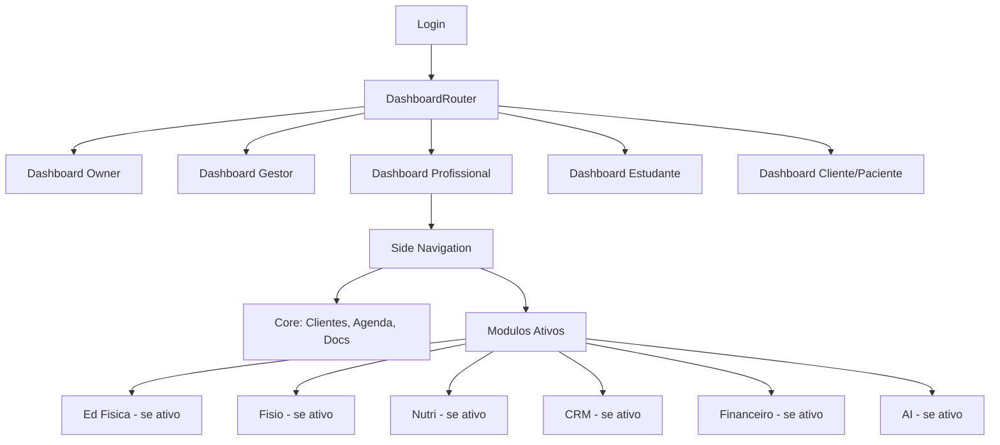

# MODULA HEALTH — UX Architecture (Web & Mobile)

## 1. Stack Frontend

| Plataforma | Stack |
|-----------|-------|
| Web | Next.js 15 (App Router) + React 19 + TypeScript |
| Mobile | React Native (Expo) + TypeScript |
| UI Components | shadcn/ui + Tailwind CSS + Radix UI |
| Server State | TanStack Query (React Query) |
| Client State | Zustand |
| Forms | React Hook Form + Zod |
| Charts | Chart.js ou Recharts |
| Tables | TanStack Table |
| Icons | Lucide React |

---

## 2. Navegacao Adaptativa



### Regras de Navegacao

1. **Menu lateral**: Mostra apenas modulos ativos
2. **Modulo inativo**: Exibe item com icone de cadeado + CTA de upgrade
3. **Dashboard contextual**: Widgets diferentes por perfil e modulos ativos
4. **Ficha do cliente**: Tabs por area (geral, EF, fisio, nutri, multi) — tabs inativas se modulo inativo
5. **Coesao visual**: Design system unico — modulos parecem partes naturais, nao plugins
6. **Upsell in-app**: Banners contextuais, features "fantasma" com preview e CTA

---

## 3. Sidebar Navigation por Perfil

### Profissional (Personal Trainer, Fisio, Nutri)

```
🏠 Dashboard
👥 Clientes
📋 Prontuario
📅 Agenda                    [mod.agenda]
💰 Financeiro                [mod.financial]
📊 CRM                       [mod.crm]
──────────────
🏋️ Avaliacao Fisica          [ef.evaluation]
📝 Prescricao de Treino      [ef.training]
📈 Monitoramento             [ef.monitoring]
──────────────
🩺 Avaliacao Fisio           [fisio.evaluation]
📋 Plano Terapeutico         [fisio.treatment]
📝 Evolucao Clinica          [fisio.progress]
🏥 Exercicios Terap.         [fisio.exercises]
──────────────
🥗 Avaliacao Nutri           [nutri.evaluation]
🍽️ Plano Alimentar           [nutri.mealplan]
📊 Evolucao Nutri            [nutri.progress]
📓 Diario Alimentar          [nutri.foodlog]
──────────────
🔗 Encaminhamentos           [multi.referral]
📚 Biblioteca                [multi.library]
🤖 AI Copiloto               [ai.suite]
──────────────
💬 Comunicacao               [mod.communication]
⚙️ Configuracoes
```

*Itens aparecem condicionalmente baseado nos modulos ativos e profissao do usuario.*

### Gestor (Owner, Manager)

```
🏠 Dashboard Executivo
👥 Equipe
🏢 Unidades
──────────────
📊 Comercial (CRM)           [mod.crm]
💰 Financeiro                [mod.financial]
📅 Operacional (Agenda)      [mod.agenda]
📈 Analytics                 [mod.analytics]
──────────────
💬 Comunicacao               [mod.communication]
🤖 AI Analytics              [ai.copilot.analytics]
──────────────
💳 Assinatura & Plano        [core.billing]
⚙️ Configuracoes
🔒 Auditoria                 [core.audit]
```

### Cliente / Paciente / Aluno

```
🏠 Meu Dashboard
📅 Minha Agenda
──────────────
🏋️ Meus Treinos              [ef.training ativo]
🥗 Meu Plano Alimentar       [nutri.mealplan ativo]
🏥 Meus Exercicios           [fisio.exercises ativo]
──────────────
📈 Minha Evolucao            [mod.portal]
🎯 Minhas Metas              [multi.habits]
📓 Meu Diario                [nutri.foodlog / multi.habits]
──────────────
📄 Meus Documentos
💰 Meus Pagamentos
💬 Mensagens
⚙️ Meu Perfil
```

### Estudante

```
🏠 Dashboard Academico
📚 Trilhas de Aprendizagem
📝 Simulados
🃏 Flashcards
──────────────
📒 Diario de Estagio
👨‍🏫 Supervisao
📁 Meu Portfolio
──────────────
🤖 AI Tutor                  [ai.copilot.tutor]
💬 Forum
👥 Grupo de Estudo
⚙️ Meu Perfil
```

---

## 4. Dashboards por Perfil

### 4.1 Dashboard do Profissional

```
┌─────────────────────────────────────────────────────────────┐
│  DASHBOARD — Bom dia, Dr. Carlos                            │
├─────────┬──────────┬──────────┬──────────┬─────────────────┤
│ CLIENTES│ SESSOES  │ PENDENCIAS│ ADERENCIA│ RECEITA MES    │
│  47     │  8 hoje  │   3      │  82%     │  R$ 12.450     │
├─────────┴──────────┴──────────┴──────────┴─────────────────┤
│                                                             │
│  ┌─────────────────────┐  ┌──────────────────────────────┐ │
│  │   AGENDA DE HOJE    │  │   ACOES RAPIDAS              │ │
│  │                     │  │                              │ │
│  │  09:00 João Silva   │  │  [+ Nova Avaliacao]          │ │
│  │  10:00 Maria Santos │  │  [+ Novo Treino]             │ │
│  │  11:00 Pedro Lima   │  │  [+ Agendar]                 │ │
│  │  14:00 Ana Costa    │  │  [+ Novo Cliente]            │ │
│  │  15:00 Lucas Alves  │  │                              │ │
│  │  ...                │  │                              │ │
│  └─────────────────────┘  └──────────────────────────────┘ │
│                                                             │
│  ┌─────────────────────────────────────────────────────────┐│
│  │   AI INSIGHTS                                           ││
│  │                                                         ││
│  │  ⚡ 3 clientes com aderencia <60% esta semana           ││
│  │  📊 Joao Silva precisa de reavaliacao (90 dias)         ││
│  │  💡 Sugestao: ajustar treino de Maria (feedback negativo)││
│  └─────────────────────────────────────────────────────────┘│
│                                                             │
│  ┌───────────────────┐  ┌──────────────────────────────────┐│
│  │  ALERTAS          │  │  ADERENCIA SEMANAL (grafico)     ││
│  │  ⚠ 2 pagamentos   │  │  ████████████░░░░░  82%         ││
│  │    vencidos       │  │                                  ││
│  │  📋 1 avaliacao   │  │  [Chart: aderencia por semana]   ││
│  │    pendente       │  │                                  ││
│  └───────────────────┘  └──────────────────────────────────┘│
└─────────────────────────────────────────────────────────────┘
```

### 4.2 Dashboard do Gestor

```
┌─────────────────────────────────────────────────────────────┐
│  DASHBOARD EXECUTIVO — Studio Performance                    │
│  [Unidade: São Paulo ▾]                                     │
├──────────┬──────────┬──────────┬──────────┬────────────────┤
│ RECEITA  │ CLIENTES │ OCUPACAO │ CHURN    │ NPS            │
│ R$85.2K  │  312     │  78%     │  4.2%    │  72            │
├──────────┴──────────┴──────────┴──────────┴────────────────┤
│                                                             │
│  ┌────────────────────────┐  ┌─────────────────────────────┐│
│  │  RECEITA MENSAL        │  │  FUNIL COMERCIAL            ││
│  │  [Chart: barras/linha] │  │  Leads: 45                  ││
│  │                        │  │  Contato: 32                ││
│  │  Jan Fev Mar Abr Mai   │  │  Agendados: 18              ││
│  │  ███ ███ ███ ███ ███   │  │  Avaliados: 12              ││
│  │                        │  │  Convertidos: 8             ││
│  └────────────────────────┘  └─────────────────────────────┘│
│                                                             │
│  ┌────────────────────────────────────────────────────────┐ │
│  │  PERFORMANCE DA EQUIPE                                 │ │
│  │  Profissional  | Clientes | Receita  | Ocupacao | NPS  │ │
│  │  Carlos Silva  |    47    | R$12.4K  |   85%    |  78  │ │
│  │  Ana Santos    |    38    | R$10.2K  |   72%    |  82  │ │
│  │  Pedro Lima    |    42    | R$11.8K  |   80%    |  75  │ │
│  └────────────────────────────────────────────────────────┘ │
│                                                             │
│  ┌──────────────────┐  ┌──────────────────────────────────┐ │
│  │ AI EXECUTIVE     │  │  ALERTAS DE NEGOCIO              │ │
│  │ INSIGHTS         │  │                                  │ │
│  │ 📉 Retencao caiu │  │  🔴 Inadimplencia +15% vs mes   │ │
│  │    3% vs mes ant.│  │  🟡 Ocupacao sexta-feira <50%    │ │
│  │ 💡 Reativar 12   │  │  🟢 NPS subiu 5 pontos          │ │
│  │    clientes      │  │                                  │ │
│  └──────────────────┘  └──────────────────────────────────┘ │
└─────────────────────────────────────────────────────────────┘
```

### 4.3 Dashboard do Cliente (Mobile-first)

```
┌──────────────────────┐
│  Ola, Maria! 👋      │
│  Seu proximo treino:  │
│  HOJE 14:00           │
│  [Ver detalhes]       │
├──────────────────────┤
│                      │
│  ┌─── PROGRESSO ───┐ │
│  │  🎯 Peso: 65kg  │ │
│  │  ↓ -2.3kg       │ │
│  │                  │ │
│  │  💪 Treinos: 12  │ │
│  │  de 16 (75%)    │ │
│  │                  │ │
│  │  [Grafico anel]  │ │
│  └──────────────────┘ │
│                      │
│  ┌── COMO VC ESTA? ─┐│
│  │  😊 😐 😔 😩    ││
│  │  Disposicao hoje ││
│  └──────────────────┘│
│                      │
│  ┌── TREINO HOJE ───┐│
│  │  Treino A -      ││
│  │  Superior        ││
│  │  8 exercicios    ││
│  │  ~60 min         ││
│  │  [Iniciar Treino]││
│  └──────────────────┘│
│                      │
│  ┌── METAS ─────────┐│
│  │  🎯 Peso: 63kg   ││
│  │  ████████░░ 80%  ││
│  │  🎯 Treinos: 4x  ││
│  │  ███████░░░ 75%  ││
│  └──────────────────┘│
│                      │
│  ┌── MENSAGENS ─────┐│
│  │  Dr. Carlos:     ││
│  │  "Otimo progresso││
│  │   Maria! Vamos..." ││
│  │  [Ver todas]     ││
│  └──────────────────┘│
└──────────────────────┘
```

### 4.4 Dashboard do Estudante

```
┌─────────────────────────────────────────────────────────────┐
│  MINHA JORNADA ACADEMICA                                     │
│  Trilha: Fisioterapia Ortopedica | 68% concluido            │
│  [████████████████████░░░░░░░░░░░]                          │
├─────────────────────────────────────────────────────────────┤
│                                                             │
│  ┌────────────────────────┐  ┌─────────────────────────────┐│
│  │  PROXIMAS TAREFAS      │  │  AI TUTOR                   ││
│  │                        │  │                             ││
│  │  📝 Quiz: Avaliacao    │  │  "Ola! Posso ajudar com     ││
│  │     postural (amanha)  │  │   duvidas sobre o caso      ││
│  │  📒 Diario de estagio  │  │   do paciente de hoje?"     ││
│  │     (pendente)         │  │                             ││
│  │  📚 Aula 12: Joelho   │  │  [Iniciar conversa]         ││
│  │     (assistir)         │  │                             ││
│  └────────────────────────┘  └─────────────────────────────┘│
│                                                             │
│  ┌────────────────────────────────────────────────────────┐ │
│  │  FEEDBACK DO SUPERVISOR                                │ │
│  │                                                        │ │
│  │  Prof. Ana (12/03): "Boa evolucao na avaliacao de      │ │
│  │  ombro. Atentar para testes especiais — revisar        │ │
│  │  Neer e Hawkins."                                      │ │
│  │                                                        │ │
│  │  Nota: 8.5/10                                          │ │
│  └────────────────────────────────────────────────────────┘ │
│                                                             │
│  ┌────────────────────────┐  ┌─────────────────────────────┐│
│  │  MEU PORTFOLIO         │  │  COMPETENCIAS               ││
│  │                        │  │                             ││
│  │  📁 5 casos            │  │  Avaliacao:  ███████░░ 70%  ││
│  │  📄 3 relatorios       │  │  Conduta:    ██████░░░ 60%  ││
│  │  🏆 2 certificados     │  │  Evolucao:   ████████░ 80%  ││
│  │                        │  │  Comunicacao:█████████░ 90%  ││
│  │  [Ver portfolio]       │  │                             ││
│  └────────────────────────┘  └─────────────────────────────┘│
└─────────────────────────────────────────────────────────────┘
```

---

## 5. Ficha do Cliente (Visao 360)

### Layout

```
┌─────────────────────────────────────────────────────────────┐
│  MARIA SANTOS                           Status: Ativa       │
│  32 anos | F | Personal + Nutricionista                     │
│  Desde: 15/01/2024 | Profissional: Dr. Carlos             │
├────────┬────────┬────────┬────────┬────────┬───────────────┤
│ Geral  │  EF    │ Fisio  │ Nutri  │ Multi  │  Prontuario  │
├────────┴────────┴────────┴────────┴────────┴───────────────┤
│                                                             │
│  [Conteudo da tab selecionada]                             │
│                                                             │
│  Tab "Geral":                                              │
│  - Dados pessoais, contatos, responsaveis                  │
│  - Tags, observacoes, campos customizados                  │
│  - Profissionais vinculados                                │
│  - Timeline de interacoes                                  │
│                                                             │
│  Tab "EF" (se modulo ativo):                               │
│  - Ultimas avaliacoes fisicas                              │
│  - Treino atual                                            │
│  - Historico de cargas                                     │
│  - Evolucao de composicao corporal                         │
│                                                             │
│  Tab "Fisio" (se modulo ativo):                            │
│  - Avaliacoes fisioterapeuticas                            │
│  - Plano terapeutico                                       │
│  - Evolucoes (SOAP)                                        │
│  - Exercicios domiciliares                                 │
│                                                             │
│  Tab "Nutri" (se modulo ativo):                            │
│  - Avaliacao nutricional                                   │
│  - Plano alimentar                                         │
│  - Diario alimentar                                        │
│  - Exames laboratoriais                                    │
│                                                             │
│  Tab "Multi" (se multi.evaluation ativo):                  │
│  - Visao consolidada                                       │
│  - Metas compartilhadas                                    │
│  - Encaminhamentos                                         │
│  - Care Path                                               │
│                                                             │
│  Tab "Prontuario":                                         │
│  - Timeline cronologica unificada                          │
│  - Todos os eventos (avaliacoes, sessoes, evolucoes...)    │
│  - Filtros por tipo, profissional, area                    │
│  - Documentos anexados                                     │
└─────────────────────────────────────────────────────────────┘
```

---

## 6. Principios de UX

### Modularidade Visual

- Modulos ativos aparecem como partes naturais da interface
- Modulos inativos aparecem com visual "ghost" (preview) + CTA de upgrade
- Nenhum modulo inativo deve gerar confusao — o usuario entende que e expansivel

### Upsell In-App

- Banners contextuais quando o profissional tenta uma acao de modulo inativo
- Features "fantasma" com preview visual do que faria
- CTAs claros: "Ative o modulo de CRM e comece a vender mais"
- Trial instantaneo com 1 clique

### Responsive Design

- **Web**: Layout com sidebar (desktop), collapsible (tablet)
- **Mobile (portal do cliente)**: Mobile-first, bottom navigation
- **Mobile (profissional)**: Responsive web, com funcionalidades core acessiveis

### Acessibilidade

- Contraste WCAG AA
- Navegacao por teclado
- Screen reader support (Radix UI)
- Tamanho minimo de toque (44px mobile)

### Performance

- Next.js App Router com Server Components
- Skeleton loading para dados assincronos
- Paginacao server-side para listas grandes
- Cache com TanStack Query (staleTime configuravel)
- Lazy loading de modulos inativos

---

## 7. Mapa de Paginas (Resumo)

### Area do Profissional (~80 telas)

| Secao | Paginas Principais |
|-------|-------------------|
| Dashboard | Dashboard contextual por perfil |
| Clientes | Lista, ficha 360, cadastro, importacao, merge |
| Prontuario | Timeline, entrada individual, exportacao |
| Agenda | Calendario (dia/semana/mes), agendamento, check-in, ocupacao |
| EF | Avaliacao (wizard), treino (builder), biblioteca, monitoramento |
| Fisio | Avaliacao (multi-step), plano terapeutico, evolucao SOAP, exercicios |
| Nutri | Avaliacao, plano alimentar (builder), diario, receitas |
| CRM | Funil Kanban, leads, propostas, contratos, campanhas |
| Financeiro | Dashboard, cobrancas, planos, repasses, DRE |
| Comunicacao | Inbox, chat, campanhas, automacoes, NPS |
| AI | Copiloto sidebar, insights, feedback |
| Configuracoes | Perfil, disponibilidade, preferencias |

### Area do Gestor (~30 telas)

| Secao | Paginas Principais |
|-------|-------------------|
| Dashboard | Dashboard executivo, por unidade |
| Equipe | Lista de profissionais, performance, repasses |
| Unidades | Gestao de unidades, configuracoes por unidade |
| Comercial | CRM overview, funil, pipeline |
| Financeiro | DRE, fluxo de caixa, comissoes |
| Operacional | Ocupacao, no-show, produtividade |
| Analytics | Dashboards, relatorios, builder, alertas |
| Billing | Plano, modulos, faturas, upgrade |
| Configuracoes | Empresa, branding, templates, integracoes |
| Auditoria | Logs, exportacao |

### Area do Cliente (~15 telas)

| Secao | Paginas Principais |
|-------|-------------------|
| Dashboard | Resumo, proximo compromisso, progresso |
| Agenda | Proximas sessoes, historico |
| Treinos | Treino do dia, historico, videos |
| Plano Alimentar | Refeicoes, substituicoes |
| Exercicios | Programa domiciliar, videos |
| Evolucao | Graficos, fotos, metas |
| Diario | Alimentar, sintomas, habitos |
| Pagamentos | Faturas, historico, pagar |
| Documentos | Exames, contratos |
| Mensagens | Chat com profissional |
| Perfil | Dados pessoais, consentimentos |

### Area do Estudante (~12 telas)

| Secao | Paginas Principais |
|-------|-------------------|
| Dashboard | Progresso, tarefas, feedback |
| Trilhas | Catalogo, player de aula, quizzes |
| Estagio | Diario, supervisao, feedback |
| Portfolio | Casos, certificados, competencias |
| AI Tutor | Chat interativo |
| Forum | Discussoes, grupos de estudo |

### Admin Master (~8 telas)

| Secao | Paginas Principais |
|-------|-------------------|
| Dashboard | KPIs, MRR, tenants, saude do sistema |
| Tenants | Lista, drill-down, detalhes |
| Modulos | Adocao, ativacoes |
| AI Monitor | Tokens, custo, guardrails |
| Sistema | Saude, infraestrutura |
| Suporte | Tickets, alertas |

**Total estimado: ~250+ telas**
