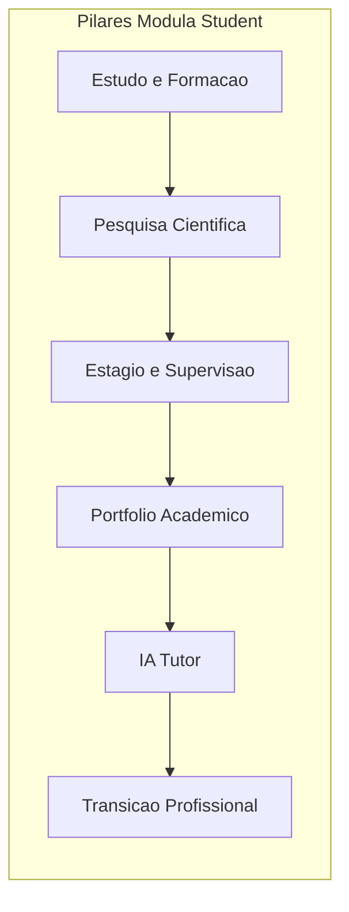
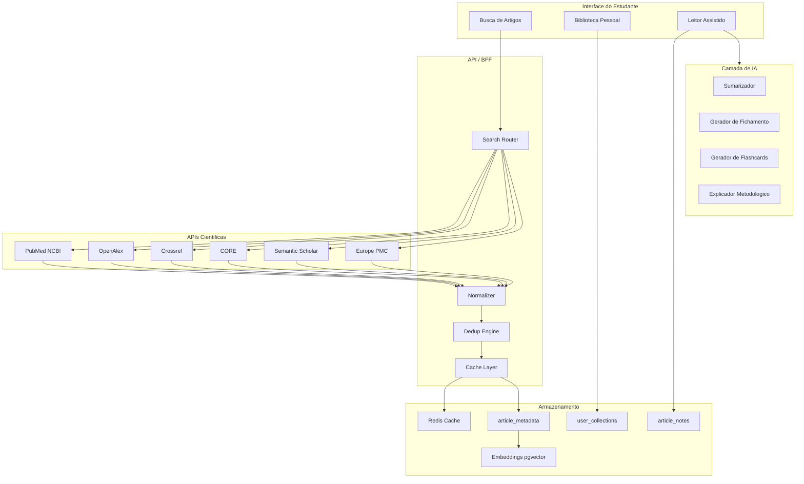
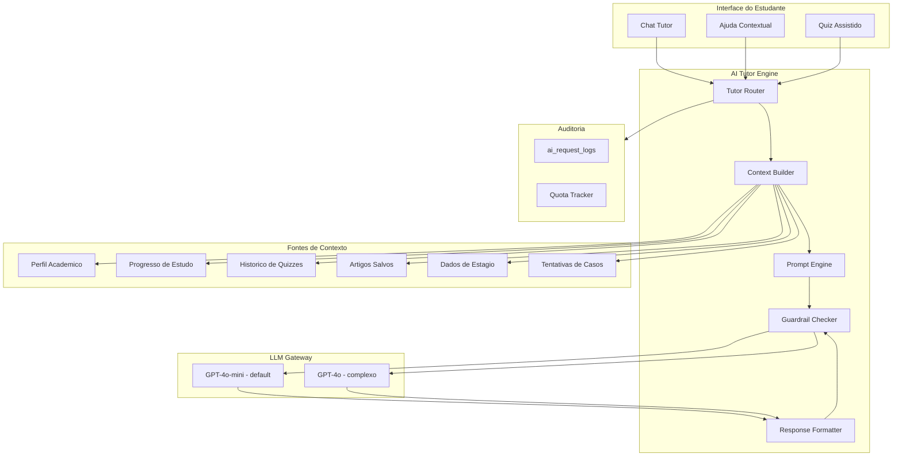
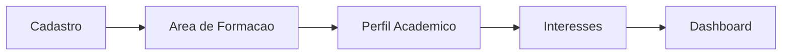
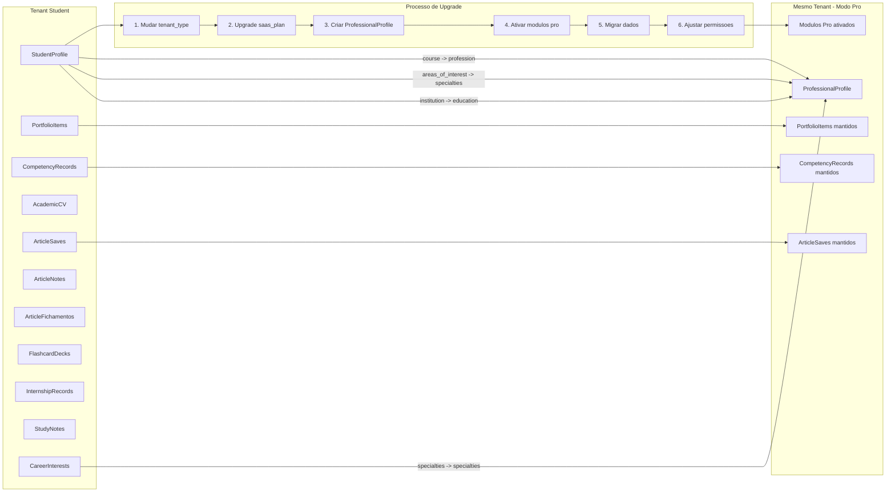
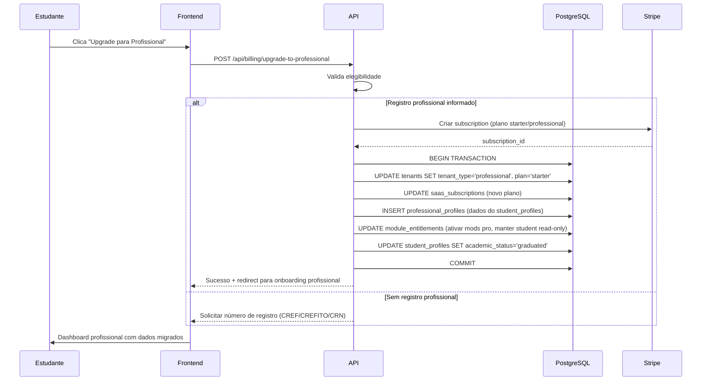

# Modula Health Student — Arquitetura Completa

> Documento de referência para produto, arquitetura funcional e arquitetura técnica do Modula Health para assinantes estudantes.

---

## Sumário

1. [Executive Summary](#1-executive-summary)
2. [Product Vision for Student Subscribers](#2-product-vision-for-student-subscribers)
3. [Student Module Catalog](#3-student-module-catalog)
4. [Detailed Functional Inventory](#4-detailed-functional-inventory)
5. [Scientific Research Module Design](#5-scientific-research-module-design)
6. [Student AI Tutor Architecture](#6-student-ai-tutor-architecture)
7. [Permissions and Boundaries](#7-permissions-and-boundaries)
8. [UX for Student Subscribers](#8-ux-for-student-subscribers)
9. [Domain Model for Student Mode](#9-domain-model-for-student-mode)
10. [Technical Architecture Recommendation](#10-technical-architecture-recommendation)
11. [Billing and Commercial Strategy](#11-billing-and-commercial-strategy)
12. [Upgrade Path to Professional Plan](#12-upgrade-path-to-professional-plan)
13. [Example End-to-End Flows](#13-example-end-to-end-flows)
14. [Risks and Tradeoffs](#14-risks-and-tradeoffs)
15. [Final Recommendation](#15-final-recommendation)

---

## 1. Executive Summary

O Modula Health Student é a vertical dedicada a estudantes de Educação Física, Fisioterapia e Nutrição dentro do Modula Health. Diferente da abordagem atual — onde o estudante é um papel (`role: student`, hierarchy 20) subordinado a um tenant profissional/institucional — esta proposta eleva o estudante a **assinante principal do produto**, com tenant próprio, billing independente, módulos dedicados e jornada autônoma.

### Estado atual no codebase

| Elemento | Situação |
|----------|----------|
| Role `student` (hierarchy 20) | Existe em `00013_seed.sql`, sem permissões definidas |
| Role `intern` (hierarchy 30) | Existe, sem permissões definidas |
| Módulo `mod.education` | No catálogo, focado em tenants profissionais |
| Enum `saas_plan_tier` | Apenas: `starter`, `professional`, `business`, `enterprise` |
| Tabelas de domínio estudantil | Não existem (StudyPlan, Flashcard, CaseStudy, etc.) |
| Protótipo de dashboard estudante | `prototypes/dashboard-estudante.html` (HTML estático) |
| AI Tutor (`ai.copilot.tutor`) | No catálogo, sem implementação |
| Tabela `student_profiles` | Não existe |

### Decisão arquitetural central

O estudante terá um **tenant próprio** (com flag `tenant_type = 'student'`), **planos SaaS dedicados** (`student`, `student_plus`), e **módulos novos** no catálogo que complementam os existentes. A migração para plano profissional será uma operação de **upgrade de tenant**, preservando todos os dados.

### Impacto no schema existente

- Novo valor no enum `saas_plan_tier`: `'student'`, `'student_plus'`
- Nova coluna em `tenants`: `tenant_type` (enum: `professional`, `student`)
- Nova tabela: `student_profiles` (FK para `user_profiles`)
- 9 novos módulos no `module_catalog` (categoria `student`)
- ~25 novas tabelas de domínio estudantil
- Novas permissões para roles `student` e `intern`
- 2 novos planos em `saas_plans`
- Novas políticas RLS para isolamento de dados estudantis

---

## 2. Product Vision for Student Subscribers

### Proposta de valor

O Modula Health Student resolve 5 dores concretas do estudante de saúde:

| Dor | Solução |
|-----|---------|
| Estudo fragmentado (caderno + app + drive + WhatsApp) | Plataforma unificada com trilhas, flashcards, simulados e calendário acadêmico |
| Pesquisa científica difícil e desorganizada | Busca federada em PubMed/OpenAlex/Crossref com fichamento assistido por IA |
| Estágio sem ferramenta adequada | Diário digital, registro de horas, feedback de supervisor, portfólio |
| Transição para profissional sem continuidade | Migração de plano com preservação total de dados, portfólio e histórico |
| IA inacessível para aprendizado | AI Tutor contextualizado por área com guardrails acadêmicos |

### Pilares da experiência



### Segmentação por fase de formação

O sistema adapta a experiência conforme o estágio acadêmico:

| Fase | Semestre (aprox.) | Ênfase do sistema |
|------|-------------------|-------------------|
| Início | 1–2 | Organização acadêmica, trilhas básicas, hábito de estudo |
| Intermediário | 3–5 | Casos práticos, pesquisa científica, simulados |
| Estágio | 6–8 | Diário de estágio, supervisão, portfólio, casos clínicos |
| Transição | 9–10 | Currículo profissional, upgrade de plano, portfólio final |

O campo `academic_phase` no perfil do estudante (derivado de `current_semester` / `total_semesters`) determina quais trilhas, sugestões e CTAs são exibidos.

### Diferencial competitivo por área

| Área | Diferencial Student |
|------|---------------------|
| Educação Física | Casos de prescrição de exercício, avaliação física simulada, periodização acadêmica, banco de exercícios de estudo |
| Fisioterapia | Casos clínicos ortopédicos/neurológicos, testes especiais interativos, SOAP acadêmico, escalas funcionais |
| Nutrição | Cálculos nutricionais guiados, recordatório alimentar simulado, plano alimentar acadêmico, tabelas de composição |

---

## 3. Student Module Catalog

### Módulos novos a criar

Novos módulos para o `module_catalog`:

| Código | Nome | Categoria | Core Student? | Core Student Plus? | Preço add-on (centavos/mês) | Trial (dias) |
|--------|------|-----------|---------------|--------------------|-----------------------------|--------------|
| `student.core` | Core Acadêmico | student | Sim | Sim | 0 | 0 |
| `student.study` | Educação e Estudo | student | Sim | Sim | 0 | 0 |
| `student.internship` | Estágio e Supervisão | student | Sim | Sim | 0 | 0 |
| `student.portfolio` | Portfólio Acadêmico | student | Sim | Sim | 0 | 0 |
| `student.cases` | Casos Práticos | student | Sim | Sim | 0 | 0 |
| `student.research` | Pesquisa Científica | student | Lite | Full | 1900 | 14 |
| `student.tutor` | AI Tutor Acadêmico | student | Lite (30 req/mês) | Full (300 req/mês) | 2900 | 7 |
| `student.organization` | Organização Acadêmica | student | Sim | Sim | 0 | 0 |
| `student.career` | Preparação Profissional | student | Não | Sim | 1900 | 14 |

### Módulos existentes reutilizados

| Módulo existente | Uso no contexto estudantil |
|------------------|---------------------------|
| `core.auth` | Autenticação e MFA |
| `core.users` | Perfil base (`user_profiles`) |
| `core.documents` | Upload de certificados, trabalhos, relatórios |
| `core.notifications` | Notificações in-app |
| `core.tenant` | Tenant do estudante |
| `core.billing` | Billing do plano student |
| `core.audit` | Auditoria básica |

### Módulos que NÃO se aplicam ao plano estudante

| Categoria | Módulos bloqueados | Motivo |
|-----------|-------------------|--------|
| Clínico | `core.clients`, `core.records`, `core.consent`, `core.portal` | Gestão de clientes/pacientes |
| Operacional | `mod.crm`, `mod.financial`, `mod.agenda` | Operações profissionais |
| Domínio profissional | `ef.*`, `fisio.*`, `nutri.*` | Requerem upgrade para profissional |
| IA profissional | `ai.copilot.ef/fisio/nutri/commercial/ops/multi/analytics` | Copilotos profissionais |
| Comunicação | `mod.communication` | Marketing e campanhas |

### Limites por tipo de módulo

| Funcionalidade | Student (lite) | Student Plus (full) | Upgrade (profissional) |
|----------------|---------------|--------------------|-----------------------|
| Pesquisa: buscas/mês | 50 | 300 | Ilimitado |
| Pesquisa: artigos salvos | 100 | 1.000 | Ilimitado |
| Pesquisa: fichamentos IA/mês | 5 | 50 | Via copiloto |
| AI Tutor: requisições/mês | 30 | 300 | Via copilotos dedicados |
| Flashcards: decks | 20 | Ilimitado | N/A |
| Simulados: por mês | 5 | Ilimitado | N/A |
| Casos práticos: acesso | Básicos | Todos | Casos reais |
| Storage | 1 GB | 5 GB | Conforme plano pro |
| Portfólio público | Não | Sim | Sim |
| Preparação profissional | Não | Sim | N/A |

---

## 4. Detailed Functional Inventory

### 4.1 student.core — Core Acadêmico

**Tabela `student_profiles`** (FK para `user_profiles`):

| Campo | Tipo | Descrição | Migra para profissional? |
|-------|------|-----------|--------------------------|
| `id` | uuid PK | Identificador | — |
| `user_id` | uuid FK UNIQUE | Vínculo com `user_profiles` | Mantém `user_profiles` |
| `tenant_id` | uuid FK | Tenant do estudante | Mantém tenant |
| `institution_name` | text | Nome da instituição | `professional_profiles.education` |
| `institution_type` | enum | publica, privada, ead | Metadado |
| `course` | enum(`profession_type`) | ef, physio, nutrition | `professional_profiles.profession` |
| `course_name` | text | Nome completo do curso | `professional_profiles.education` |
| `enrollment_number` | text | Matrícula | Arquivado |
| `current_semester` | smallint | Semestre atual | — |
| `total_semesters` | smallint | Total de semestres | — |
| `expected_graduation` | date | Previsão de formatura | — |
| `shift` | enum | morning, afternoon, evening, full_time | — |
| `academic_status` | enum | active, on_leave, graduated, transferred | — |
| `areas_of_interest` | text[] | Especializações de interesse | `professional_profiles.specialties` |
| `study_goals` | jsonb | Metas de formação | Arquivado |
| `academic_history` | jsonb | Histórico básico | `professional_profiles.education` |
| `metadata` | jsonb | Dados extras | Metadado |
| `created_at` | timestamptz | Criação | — |
| `updated_at` | timestamptz | Atualização | — |

**Funcionalidades do Core:**
- Cadastro e edição de perfil acadêmico
- Dashboard inicial adaptado por fase (início/intermediário/estágio/transição)
- Central de notificações
- Upload de certificados e trabalhos (via `core.documents`)
- Histórico de uso e métricas de estudo
- Metas de formação com tracking
- Preferências de área e especialização
- Configurações da conta
- Billing do plano estudante
- Perfil editável com avatar
- Histórico acadêmico básico

### 4.2 student.study — Educação, Formação e Estudo

**Entidades:**

| Entidade | Campos-chave |
|----------|-------------|
| `study_tracks` | id, tenant_id, area, title, description, difficulty, modules_count, estimated_hours, is_system, is_active |
| `study_track_modules` | id, track_id, title, description, order, content (jsonb), lessons_count, estimated_hours |
| `study_track_enrollments` | id, tenant_id, user_id, track_id, started_at, completed_at, progress_pct, current_module_id |
| `study_sessions` | id, tenant_id, user_id, module_id, started_at, ended_at, progress_pct, notes |
| `flashcard_decks` | id, tenant_id, user_id, title, area, discipline, card_count, is_ai_generated |
| `flashcards` | id, deck_id, front, back, difficulty, next_review_at, interval_days, ease_factor, repetitions, lapses |
| `question_bank` | id, area, discipline, question_text, options (jsonb[]), correct_option_index, explanation, difficulty, tags, is_system |
| `quizzes` | id, tenant_id, user_id, title, area, discipline, question_ids (uuid[]), answers (jsonb), score, total_questions, started_at, completed_at |
| `study_notes` | id, tenant_id, user_id, title, content, discipline, semester, tags, is_favorite |
| `study_goals` | id, tenant_id, user_id, title, description, target_value, current_value, unit (hours/items/percentage), deadline, status |
| `reading_lists` | id, tenant_id, user_id, title, description, items (jsonb[]), is_public |

**Algoritmo de revisão espaçada (SM-2):**
Cada `flashcard` utiliza o algoritmo SuperMemo 2 para espaçamento:
- `ease_factor`: inicia em 2.5, mínimo 1.3
- `interval_days`: calculado por `interval * ease_factor`
- `repetitions`: reset a 0 em caso de lapso
- `next_review_at`: data da próxima revisão
- O frontend ordena cards por `next_review_at <= now()` para sessões de revisão

**IA neste módulo:**
- Geração de plano de estudo baseado em semestre + metas + provas
- Geração automática de flashcards a partir de texto/artigo
- Quiz adaptativo (ajusta dificuldade com base em `lapses` e `score`)
- Identificação de lacunas (análise cruzada entre quizzes e flashcard lapses)
- Sugestão de conteúdo seguinte (baseado em progresso no track)
- Explicação simplificada de conceitos complexos

### 4.3 student.internship — Estágio e Supervisão

**Entidades:**

| Entidade | Campos-chave |
|----------|-------------|
| `internship_records` | id, tenant_id, user_id, institution, location, area (ef/physio/nutrition), specialty, supervisor_id, start_date, end_date, total_hours_required, hours_completed, status (active/completed/suspended), metadata |
| `internship_entries` | id, internship_id, date, hours, description, activities (text[]), reflections, attachments (uuid[] FK documents), competencies_practiced (text[]) |
| `internship_supervisors` | id, tenant_id, name, email, phone, institution, profession, registration_number, is_active |
| `supervisor_feedback` | id, entry_id, supervisor_id, rating (1-5), comments, competency_scores (jsonb), created_at |
| `competency_assessments` | id, tenant_id, user_id, internship_id, competency_code, competency_name, self_score (0-100), supervisor_score (0-100), evidence_ids (uuid[]), assessed_at |
| `internship_reports` | id, internship_id, title, content, report_type (weekly/monthly/final), status (draft/submitted/reviewed/approved), feedback, submitted_at, reviewed_at |
| `internship_checklists` | id, internship_id, title, items (jsonb[]: title, done, due_date) |

**Fluxo de supervisão:**
1. Estudante registra atividade no diário → `internship_entries`
2. Supervisor recebe notificação (via email ou link público)
3. Supervisor adiciona feedback → `supervisor_feedback`
4. Sistema atualiza competências automaticamente → `competency_assessments`
5. Estudante pode exportar relatório parcial/final → `internship_reports`

**IA neste módulo:**
- Estruturação de relatório de estágio a partir de entries
- Resumo semanal automático de atividades
- Sugestão de competências a desenvolver (gap analysis)
- Feedback sobre clareza e completude do relatório
- Organização cronológica do portfólio de estágio

### 4.4 student.portfolio — Portfólio Acadêmico e Profissional

**Entidades:**

| Entidade | Campos-chave |
|----------|-------------|
| `portfolio_items` | id, tenant_id, user_id, item_type (certificate/course/event/case/project/presentation/internship/publication), title, description, date, attachments (uuid[]), tags (text[]), is_public, metadata (jsonb), sort_order |
| `portfolio_sections` | id, tenant_id, user_id, title, description, sort_order, is_visible |
| `portfolio_section_items` | section_id, item_id, sort_order |
| `competency_records` | id, tenant_id, user_id, competency_code, competency_name, level (beginner/intermediate/advanced/expert), evidence_ids (uuid[]), source (self/supervisor/quiz/case), last_updated |
| `academic_cv` | id, tenant_id, user_id, bio, objective, education (jsonb[]), experiences (jsonb[]), skills (text[]), languages (jsonb[]), publications (jsonb[]), awards (jsonb[]), version, is_current |

**IA neste módulo:**
- Resumo automático do portfólio para perfil público
- Sugestão de organização e destaque de itens
- Transformação de linguagem acadêmica para profissional
- Geração de mini-bio acadêmica
- Geração de currículo acadêmico a partir dos dados

### 4.5 student.cases — Casos Práticos e Clínicos

**Entidades:**

| Entidade | Campos-chave |
|----------|-------------|
| `case_studies` | id, area, specialty, title, description, difficulty (beginner/intermediate/advanced), patient_scenario (jsonb), history, exam_findings, questions (jsonb[]), expected_outcomes, discussion_points, references, is_system, tags (text[]), times_attempted, avg_score |
| `case_attempts` | id, tenant_id, user_id, case_id, hypotheses (text[]), decisions (jsonb[]), reasoning, outcome_score, ai_feedback, time_spent_seconds, completed_at |
| `case_discussions` | id, case_id, user_id, content, parent_id (self-ref), created_at |
| `case_favorites` | user_id, case_id, created_at |

**Diferença entre versão student e professional:**

| Aspecto | Student | Professional |
|---------|---------|-------------|
| Tipo de caso | Simulado, fictício | Real, vinculado a `client_profiles` |
| Dados do paciente | Cenário descritivo | Prontuário real |
| Feedback | Via IA com disclaimer | Decisão clínica real |
| Registro | Portfólio acadêmico | Prontuário clínico |
| Supervisão | Opcional (estágio) | Responsabilidade profissional |

**IA neste módulo:**
- Perguntas socráticas (nunca dá resposta direta primeiro)
- Feedback sobre raciocínio clínico
- Comparação entre alternativas de conduta
- Explicação do racional
- **Disclaimer obrigatório**: "Este caso é apenas para fins de aprendizagem. Não substitui supervisão profissional."

### 4.6 student.research — Pesquisa Científica e Biblioteca Acadêmica

**Detalhado na seção 5.**

### 4.7 student.tutor — AI Tutor Acadêmico

**Detalhado na seção 6.**

### 4.8 student.organization — Organização Acadêmica

**Entidades:**

| Entidade | Campos-chave |
|----------|-------------|
| `academic_events` | id, tenant_id, user_id, title, event_type (exam/deadline/class/lab/event/meeting), date, time_start, time_end, discipline, location, priority (low/medium/high/urgent), status (pending/done/cancelled), recurrence_rule, reminder_minutes |
| `academic_tasks` | id, tenant_id, user_id, title, description, discipline, due_date, priority, status (todo/in_progress/done/cancelled), estimated_hours, actual_hours, tags |
| `weekly_plans` | id, tenant_id, user_id, week_start, blocks (jsonb[]: day, time_start, time_end, activity_type, activity_ref_id, discipline, notes), ai_generated |
| `productivity_logs` | id, tenant_id, user_id, date, study_hours, tasks_completed, articles_read, flashcards_reviewed, quizzes_taken, cases_solved, notes |

**IA neste módulo:**
- Geração de plano semanal inteligente (prioriza provas próximas, deadlines, lacunas)
- Priorização automática de tarefas (Eisenhower matrix adaptada)
- Alerta de sobrecarga acadêmica (>8h estudo/dia detectado)
- Reorganização por prazo e importância
- Sugestão de pausas e equilíbrio

### 4.9 student.career — Preparação para a Vida Profissional

**Entidades:**

| Entidade | Campos-chave |
|----------|-------------|
| `career_checklists` | id, tenant_id, user_id, items (jsonb[]: title, description, status, category, due_date) |
| `career_interests` | id, tenant_id, user_id, specialties (text[]), niches (text[]), target_audience, goals, preferred_settings (clinic/studio/hospital/home/online) |
| `upgrade_readiness` | id, tenant_id, user_id, overall_score (0-100), criteria (jsonb[]: criterion, met, weight), last_assessed_at |
| `career_milestones` | id, tenant_id, user_id, title, description, achieved_at, evidence_ids (uuid[]) |

**Funcionalidades:**
- Trilha guiada de transição estudante → profissional
- Checklist de preparação (documentos, registros profissionais, certificações)
- Mapeamento de nichos de interesse
- Preparação de currículo profissional a partir do portfólio acadêmico
- Score de prontidão para upgrade (portfólio completo, certificações, estágio)
- Botão de upgrade para plano profissional
- Preview de funcionalidades profissionais

**IA neste módulo:**
- Sugestão de posicionamento profissional com base no perfil
- Análise do portfólio para identificar pontos fortes
- Recomendação de especializações com base em interesse + mercado
- Transformação de linguagem acadêmica para profissional

---

## 5. Scientific Research Module Design

### 5.1 Arquitetura de busca federada



### 5.2 APIs científicas — Estratégia de integração

| API | Cobertura | Rate Limit | Autenticação | Dados-chave | Prioridade |
|-----|-----------|------------|--------------|-------------|------------|
| **PubMed / NCBI E-utilities** | Biomedicina, saúde, exercício | 3 req/s (com API key: 10 req/s) | API key (gratuita) | PMID, abstract, MeSH terms, open access status | P0 — fonte primária |
| **OpenAlex** | 250M+ works, multidisciplinar | Sem limite rígido (polite pool) | Não obrigatória (email recomendado) | DOI, abstract, concepts, cited_by_count, open_access | P0 — melhor para agregação |
| **Crossref** | 150M+ DOIs, metadados editoriais | 50 req/s (com Polite pool) | Email no header (Polite) | DOI, título, autores, revista, referências, licença | P0 — referência de DOI |
| **Europe PMC** | Biomedicina europeia, full-text OA | Sem limite publicado | Não | PMID, PMCID, full-text XML (OA), citações | P1 — full-text OA |
| **CORE** | 300M+ artigos OA globais | 10 req/s (com API key) | API key (gratuita) | Full-text OA, repositórios institucionais | P1 — full-text OA |
| **Semantic Scholar** | 200M+ papers, IA-enriched | 1 req/s (sem key), 10 req/s (com key) | API key (gratuita) | Paper embeddings, TLDR, influência, citações | P2 — enriquecimento |

**Recomendação de implementação em fases:**

| Fase | APIs | Justificativa |
|------|------|---------------|
| MVP Student | OpenAlex + PubMed + Crossref | Cobertura ampla, metadados ricos, DOI como chave, abstracts disponíveis |
| V2 | + Europe PMC + CORE | Acesso a full-text OA, repositórios brasileiros |
| V3 | + Semantic Scholar | TLDR automático, citation context, paper embeddings |

### 5.3 Modelo de dados normalizado

**Tabela `article_metadata`** — cache local de metadados normalizados:

| Campo | Tipo | Descrição |
|-------|------|-----------|
| `id` | uuid PK | Identificador interno |
| `doi` | text UNIQUE | Digital Object Identifier |
| `pmid` | text UNIQUE | PubMed ID |
| `pmcid` | text | PubMed Central ID |
| `openalex_id` | text | OpenAlex Work ID |
| `title` | text NOT NULL | Título |
| `abstract` | text | Abstract/resumo |
| `authors` | jsonb[] | [{name, orcid, affiliation}] |
| `journal_name` | text | Nome do periódico |
| `journal_issn` | text | ISSN |
| `publication_date` | date | Data de publicação |
| `publication_year` | smallint | Ano (indexado) |
| `volume` | text | Volume |
| `issue` | text | Número |
| `pages` | text | Páginas |
| `study_type` | text | RCT, systematic review, meta-analysis, cohort, etc. |
| `language` | text | Idioma (ISO 639-1) |
| `keywords` | text[] | Palavras-chave |
| `mesh_terms` | text[] | Termos MeSH (PubMed) |
| `concepts` | jsonb[] | Conceitos OpenAlex [{id, display_name, score}] |
| `is_open_access` | boolean | Acesso aberto? |
| `oa_url` | text | URL do full-text OA |
| `license` | text | Licença (CC-BY, etc.) |
| `cited_by_count` | integer | Citações |
| `references_count` | integer | Referências |
| `source_apis` | text[] | APIs que forneceram este artigo |
| `raw_data` | jsonb | Dados brutos originais (para debug/reprocessamento) |
| `embedding` | vector(1536) | Embedding do abstract (pgvector) |
| `fetched_at` | timestamptz | Data do fetch |
| `updated_at` | timestamptz | Última atualização |

**Índices críticos:**
- `UNIQUE(doi)` — deduplicação primária
- `UNIQUE(pmid)` — deduplicação PubMed
- `GIN(keywords)` / `GIN(mesh_terms)` — busca por termos
- `GIN(to_tsvector('portuguese', title || ' ' || abstract))` — full-text search
- `ivfflat(embedding)` — busca semântica via pgvector
- `BTREE(publication_year)` — filtro por ano

**Tabelas de relacionamento do usuário:**

| Tabela | Campos-chave | Descrição |
|--------|-------------|-----------|
| `user_article_collections` | id, tenant_id, user_id, title, description, is_default, article_count | Coleções do usuário |
| `user_article_saves` | id, tenant_id, user_id, article_id (FK article_metadata), collection_id, saved_at, tags, notes, is_favorite, read_status (unread/reading/read) | Artigos salvos |
| `article_notes` | id, tenant_id, user_id, article_id, content, highlight_text, highlight_position, note_type (highlight/comment/question), created_at | Anotações por artigo |
| `article_fichamentos` | id, tenant_id, user_id, article_id, summary, methodology, main_findings, limitations, relevance_to_practice, study_level, personal_notes, is_ai_generated, ai_model, created_at | Fichamentos |
| `research_queries` | id, tenant_id, user_id, query_text, filters (jsonb), results_count, apis_searched, created_at | Histórico de buscas |

### 5.4 Estratégia de deduplicação

A deduplicação ocorre em cascata:

```
1. DOI match (exato) → mesma entidade
2. PMID match (exato) → mesma entidade
3. Título normalizado + ano + primeiro autor → possível duplicata
   → Normalização: lowercase, remover pontuação, remover artigos
   → Similaridade: pg_trgm similarity > 0.85
4. Se duplicata confirmada → merge: manter o registro mais completo,
   unificar IDs de todas as fontes
```

**Implementação prática:**
- Na ingestão de resultados de busca, verificar DOI/PMID primeiro (O(1) via índice UNIQUE)
- Se não há DOI/PMID, usar `similarity(normalized_title, $1) > 0.85 AND publication_year = $2` via pg_trgm
- Manter campo `source_apis` como array para saber de onde veio cada artigo
- Background job para merge de duplicatas detectadas tardiamente

### 5.5 Estratégia de cache

| Camada | TTL | Conteúdo | Storage |
|--------|-----|----------|---------|
| **Resultados de busca** | 1 hora | Hash da query → lista de article_ids | Redis |
| **Metadados de artigo** | 30 dias | Dados normalizados completos | PostgreSQL (`article_metadata`) |
| **Contagem de citações** | 7 dias | cited_by_count | PostgreSQL + Redis |
| **Embeddings** | Permanente (atualização sob demanda) | Vetor 1536 do abstract | PostgreSQL (pgvector) |
| **Fichamentos IA** | Permanente | Fichamento gerado | PostgreSQL (`article_fichamentos`) |

**Estratégia de atualização:**
- Background job semanal: atualizar `cited_by_count` dos artigos mais salvos (top 1000)
- Background job mensal: reprocessar artigos sem abstract (tentar buscar em API alternativa)
- On-demand: quando usuário acessa artigo com `fetched_at > 90 dias`, tentar refresh
- Nunca deletar `article_metadata` — cache acumulativo compartilhado entre todos os tenants

### 5.6 Estratégia de busca

**Fluxo de busca federada:**

```
1. Usuário digita query (ex.: "treinamento resistido hipertrofia idosos")
2. Frontend envia para API: POST /api/research/search
3. Search Router:
   a. Verifica cache Redis (hash da query normalizada + filtros)
   b. Se cache hit → retorna imediatamente
   c. Se cache miss → dispara buscas em paralelo:
      - PubMed: esearch.fcgi + efetch.fcgi
      - OpenAlex: /works?search=...&filter=...
      - Crossref: /works?query=...
4. Article Normalizer: mapeia cada resultado para schema unificado
5. Dedup Engine: remove duplicatas por DOI/PMID/título
6. Ordena por relevância (score composto):
   - API relevance score (normalizado 0-1) × 0.4
   - cited_by_count (log scale, normalizado) × 0.3
   - Recência (decay exponencial, mais recente = maior) × 0.2
   - Open access bonus × 0.1
7. Salva em Redis (TTL 1h) e retorna página
8. Async: artigos novos são persistidos em article_metadata
9. Async: embeddings gerados para artigos sem embedding
```

**Filtros suportados:**

| Filtro | Implementação |
|--------|---------------|
| Área (EF, Fisio, Nutri) | MeSH terms + OpenAlex concepts pré-mapeados |
| Tipo de estudo | MeSH Publication Type + heurística no título |
| Ano | `publication_year BETWEEN $1 AND $2` |
| Idioma | `language = $1` |
| Open Access | `is_open_access = true` |
| Nível de evidência | Heurística: meta-analysis > systematic review > RCT > cohort > case |
| Palavra-chave | Full-text search em título + abstract |
| Autor | Busca em `authors[*].name` |
| Revista | Busca em `journal_name` |
| DOI | Busca exata em `doi` |

**Busca semântica (Plus):**
- Gerar embedding da query via OpenAI `text-embedding-3-small`
- Buscar vizinhos mais próximos via pgvector: `ORDER BY embedding <=> $query_embedding LIMIT 20`
- Combinar com resultados da busca textual para ranking híbrido

### 5.7 Identificação de open access

Hierarquia de verificação:

```
1. OpenAlex: campo `open_access.is_oa` + `open_access.oa_url` (mais confiável)
2. Europe PMC: presença de `pmcid` indica full-text no PMC
3. CORE: todos os artigos são OA por definição
4. Crossref: campo `license` (CC-BY, CC-BY-NC, etc.)
5. DOAJ: verificar se o ISSN está no DOAJ (periódico OA)
```

**Links para full-text:**
- Se `oa_url` disponível → link direto
- Se `pmcid` disponível → `https://www.ncbi.nlm.nih.gov/pmc/articles/{pmcid}/`
- Se `doi` disponível → `https://doi.org/{doi}` (pode ser paywall)
- Sempre mostrar badge "Open Access" / "Acesso Restrito"
- Nunca hospedar o PDF — apenas referenciar

### 5.8 Cuidados de licenciamento e copyright

**Regra fundamental:** O Modula Health **não armazena full-text** de artigos. Armazena apenas:

| Dado | Pode armazenar? | Justificativa |
|------|-----------------|---------------|
| Metadados (título, autores, revista, DOI, ano) | Sim | Dados factuais, não protegidos por copyright |
| Abstract | Sim, com cuidado | PubMed/OpenAlex permitem uso de abstracts para fins não-comerciais; verificar termos de cada API |
| Full-text | **Não** | Protegido por copyright; apenas referenciar URL |
| Citações e referências | Sim | Dados factuais |
| MeSH terms / concepts | Sim | Dados de classificação pública |
| Embeddings do abstract | Sim | Representação derivada, não reproduz o texto |

**Resumos e fichamentos gerados por IA:**
- Gerados a partir do abstract (não do full-text)
- Incluir disclaimer: "Resumo gerado por IA a partir do abstract. Leia o artigo completo para informações detalhadas."
- O fichamento é uma obra derivada do usuário (com assistência de IA), armazenada no tenant do usuário
- Se o usuário colar texto do artigo no chat do AI Tutor, o texto não é persistido — apenas processado em memória

**Termos de uso das APIs:**
- PubMed/NCBI: uso gratuito com API key; requer atribuição; respeitar rate limits
- OpenAlex: CC0 para metadados; uso livre
- Crossref: Polite pool com email; dados de metadados são livres
- CORE: API key gratuita; dados OA
- Semantic Scholar: API key para rate limit maior; dados de metadados livres

### 5.9 Funcionalidades de IA sobre artigos

| Funcionalidade | Input | Output | Modelo | Plano |
|---------------|-------|--------|--------|-------|
| Resumo simples | Abstract | 3-5 frases em linguagem acessível | GPT-4o-mini | Student |
| Resumo por nível | Abstract + nível (iniciante/intermediário/avançado) | Resumo adaptado | GPT-4o-mini | Student |
| Fichamento estruturado | Abstract + metadados | Objetivo, método, resultados, conclusão, limitações, relevância | GPT-4o | Plus |
| Explicação metodológica | Abstract + study_type | Explicação do desenho de estudo | GPT-4o-mini | Student (3/mês) / Plus |
| Explicação estatística | Abstract (seção de resultados) | Explicação de p-valor, IC, NNT, etc. | GPT-4o-mini | Plus |
| Geração de flashcards | Abstract + fichamento | 5-10 flashcards sobre o artigo | GPT-4o-mini | Plus |
| Geração de quiz | Abstract + fichamento | 5-10 questões de múltipla escolha | GPT-4o-mini | Plus |
| Comparação entre artigos | 2-3 abstracts | Tabela comparativa de métodos, resultados, limitações | GPT-4o | Plus |
| Tradução assistida | Abstract em inglês | Abstract traduzido + glossário de termos técnicos | GPT-4o-mini | Student (5/mês) / Plus |
| Recomendação de leitura | Artigos salvos + interesses | Lista de artigos relacionados via embeddings | Embeddings + pgvector | Plus |
| Nível de evidência | Abstract + study_type | Classificação na pirâmide de evidência + explicação | GPT-4o-mini | Student |
| Glossário de termos | Abstract | Termos técnicos extraídos + definições | GPT-4o-mini | Student |

### 5.10 Entidades completas do módulo

```
student.research
├── article_metadata          (compartilhada entre tenants, cache global)
├── user_article_collections  (por tenant/user)
├── user_article_saves        (por tenant/user)
├── article_notes             (por tenant/user)
├── article_fichamentos       (por tenant/user)
├── article_flashcards        (por tenant/user, FK para flashcard_decks)
├── research_queries          (por tenant/user, histórico)
└── article_associations      (por tenant/user, links com: case_studies, study_tracks, internship_records)
```

**Tabela `article_associations`:**

| Campo | Tipo | Descrição |
|-------|------|-----------|
| `id` | uuid PK | — |
| `tenant_id` | uuid FK | — |
| `user_id` | uuid FK | — |
| `article_id` | uuid FK | Artigo |
| `target_type` | enum | case_study, study_track, internship, discipline, portfolio_item |
| `target_id` | uuid | ID do alvo |
| `notes` | text | Nota sobre a associação |
| `created_at` | timestamptz | — |

---

## 6. Student AI Tutor Architecture

### 6.1 Visão geral

O AI Tutor é o copiloto de IA dedicado ao estudante. Diferente dos copilotos profissionais (que auxiliam em decisões clínicas reais), o AI Tutor foca exclusivamente em **aprendizagem**, com guardrails específicos para o contexto acadêmico.



### 6.2 Modos do tutor

| Modo | Descrição | Contexto utilizado | Modelo |
|------|-----------|-------------------|--------|
| `tutor.general` | Chat livre por área (EF/Fisio/Nutri) | Perfil acadêmico, semestre, interesses | GPT-4o-mini |
| `tutor.discipline` | Tutor por disciplina específica | Disciplina, notas de estudo, progresso | GPT-4o-mini |
| `tutor.methodology` | Tutor de metodologia científica | Artigos salvos, fichamentos | GPT-4o-mini |
| `tutor.internship` | Tutor de estágio | Dados de estágio, entradas, competências | GPT-4o-mini |
| `tutor.article` | Tutor de leitura de artigos | Abstract, metadados, fichamento | GPT-4o-mini |
| `tutor.case` | Tutor de casos práticos | Caso, tentativas anteriores, score | GPT-4o |
| `tutor.exam_prep` | Tutor de revisão para prova | Quiz history, lacunas identificadas, flashcard lapses | GPT-4o-mini |
| `tutor.coaching` | Coaching acadêmico básico | Metas, progresso, produtividade, calendário | GPT-4o-mini |

### 6.3 Context Builder — Fontes de contexto

Para cada requisição ao tutor, o Context Builder monta o contexto relevante:

```
1. Perfil acadêmico: curso, semestre, fase, interesses
2. Contexto da conversa: últimas N mensagens do chat (window: 10 msgs)
3. Contexto do módulo ativo:
   - Se em trilha de estudo → progresso, módulo atual, anotações
   - Se em caso prático → cenário, tentativas, score
   - Se em artigo → abstract, metadados, fichamento
   - Se em estágio → entradas recentes, feedback, competências
4. Lacunas identificadas: tópicos com score baixo em quizzes
5. Metadados: área (ef/physio/nutrition), especialidade se aplicável
```

**Limite de contexto:** Máximo 4.000 tokens de contexto injetado (para manter custo baixo com GPT-4o-mini). Se contexto exceder, priorizar: conversa recente > contexto do módulo > perfil > lacunas.

### 6.4 Guardrails

**Guardrails de input:**
- Tamanho máximo: 2.000 caracteres por mensagem
- Bloqueio de tópicos: política, religião, conteúdo sexual, violência
- Detecção de prompt injection básica
- Detecção de tentativa de uso como "profissional" (ex.: "meu paciente tem...")

**Guardrails de output:**
- **Proibido**: diagnóstico médico/clínico, prescrição de medicamentos, dosagem de suplementos para pessoas reais
- **Obrigatório em casos**: disclaimer "para fins de aprendizagem"
- **Obrigatório em artigos**: "baseado no abstract disponível"
- **Padrão socrático**: em casos práticos, perguntar antes de responder
- **Citação de fontes**: quando possível, referenciar artigos/conceitos
- **Nível de linguagem**: adaptar ao semestre do estudante

**Frases obrigatórias no system prompt:**
```
- "Você é um tutor acadêmico, não um profissional de saúde."
- "Nunca forneça diagnósticos ou prescrições para pessoas reais."
- "Sempre incentive o estudante a buscar supervisão profissional."
- "Em casos práticos, use perguntas socráticas antes de revelar respostas."
- "Cite fontes quando possível."
```

### 6.5 Diferenças entre IA para estudante vs. profissional

| Aspecto | AI Tutor (Estudante) | Copilotos (Profissional) |
|---------|---------------------|-------------------------|
| Objetivo | Ensinar, explicar, questionar | Auxiliar em decisões clínicas reais |
| Tom | Pedagógico, socrático | Técnico, direto |
| Dados de paciente | Nunca (casos fictícios) | Dados reais do prontuário |
| Responsabilidade | Nenhuma — aprendizado | Rascunho para revisão profissional |
| Guardrails | Anti-diagnóstico, anti-prescrição | Anti-diagnóstico definitivo, sempre rascunho |
| Contexto | Perfil acadêmico + progresso | Prontuário + histórico clínico |
| Nível de evidência | Simplificado | Detalhado com referências |
| Human-in-the-loop | Supervisor (quando em estágio) | Profissional responsável (sempre) |

### 6.6 Quotas e limites

| Plano | Requests/mês | Modelo padrão | Modelo avançado | Contexto máximo |
|-------|-------------|---------------|-----------------|-----------------|
| Student | 30 | GPT-4o-mini | Não disponível | 4K tokens |
| Student Plus | 300 | GPT-4o-mini | GPT-4o (30 req/mês) | 8K tokens |
| Add-on extra | +100 req | GPT-4o-mini | — | 4K tokens |

**Rate limiting:** 5 req/min por usuário; 50 req/h por tenant estudante.

### 6.7 Logging e auditoria

Cada requisição ao tutor gera um registro em `ai_request_logs` (tabela existente):

| Campo | Valor para student.tutor |
|-------|-------------------------|
| `copilot` | `student.tutor` |
| `model` | `gpt-4o-mini` ou `gpt-4o` |
| `action` | `tutor.general`, `tutor.case`, etc. |
| `input_tokens` | Tokens de entrada |
| `output_tokens` | Tokens de saída |
| `estimated_cost_cents` | Custo estimado |
| `latency_ms` | Latência |
| `status` | success/error/guardrail_blocked |
| `context_without_pii` | Contexto sem dados pessoais |
| `feedback` | Avaliação do estudante (thumbs up/down) |

**Human-in-the-loop:**
- Em modo `tutor.internship`, se o estudante tem supervisor cadastrado, o supervisor pode ver o histórico de interações com o tutor (opt-in)
- Respostas sobre condutas clínicas incluem nota: "Discuta esta abordagem com seu supervisor"
- Nenhuma ação do tutor modifica dados automaticamente — sempre requer confirmação do estudante

### 6.8 Entidades do módulo

| Tabela | Campos-chave |
|--------|-------------|
| `tutor_conversations` | id, tenant_id, user_id, mode (general/discipline/case/article/etc.), area, title, created_at, last_message_at, message_count, is_archived |
| `tutor_messages` | id, conversation_id, role (user/assistant/system), content, metadata (jsonb: model, tokens, latency, context_sources), created_at |
| `tutor_feedback` | id, message_id, user_id, rating (thumbs_up/thumbs_down), comment, created_at |

---

## 7. Permissions and Boundaries

### 7.1 Modelo de permissões para estudantes

O sistema de permissões existente (`roles` + `role_permissions` + `user_roles`) é reutilizado integralmente. O estudante assinante usa a role `owner` no próprio tenant (ele é o dono), com **module entitlements** restringindo o que pode acessar.

**Cenários de permissão:**

| Cenário | Role | Tenant | Módulos acessíveis |
|---------|------|--------|---------------------|
| Estudante assinante individual | `owner` | Próprio (type=student) | student.* + core.auth/users/documents/notifications/tenant/billing/audit |
| Estudante com supervisor | `owner` | Próprio | Idem + supervisor tem acesso de leitura via link |
| Estudante vinculado a instituição | `student` | Da instituição | Módulos que a instituição ativar |
| Estudante em estágio | `owner` | Próprio | student.* (supervisor acessa via `internship_supervisors` sem ser user do tenant) |
| Estudante em transição | `owner` | Próprio (upgrading) | student.* + preview de módulos profissionais |

### 7.2 Permissões detalhadas por módulo

```sql
-- Permissões para role 'owner' em tenant tipo 'student'
-- (inseridas via seed ou onboarding)

-- student.core
('owner', 'student.core', 'student_profiles', '{create,read,update}'),
('owner', 'student.core', 'dashboard', '{read}'),

-- student.study
('owner', 'student.study', 'study_tracks', '{read}'),
('owner', 'student.study', 'study_sessions', '{create,read,update,delete}'),
('owner', 'student.study', 'flashcard_decks', '{create,read,update,delete}'),
('owner', 'student.study', 'flashcards', '{create,read,update,delete}'),
('owner', 'student.study', 'quizzes', '{create,read}'),
('owner', 'student.study', 'study_notes', '{create,read,update,delete}'),
('owner', 'student.study', 'study_goals', '{create,read,update,delete}'),
('owner', 'student.study', 'reading_lists', '{create,read,update,delete}'),
('owner', 'student.study', 'question_bank', '{read}'),

-- student.internship
('owner', 'student.internship', 'internship_records', '{create,read,update}'),
('owner', 'student.internship', 'internship_entries', '{create,read,update,delete}'),
('owner', 'student.internship', 'internship_supervisors', '{create,read,update}'),
('owner', 'student.internship', 'internship_reports', '{create,read,update}'),
('owner', 'student.internship', 'competency_assessments', '{read}'),

-- student.portfolio
('owner', 'student.portfolio', 'portfolio_items', '{create,read,update,delete}'),
('owner', 'student.portfolio', 'portfolio_sections', '{create,read,update,delete}'),
('owner', 'student.portfolio', 'competency_records', '{read}'),
('owner', 'student.portfolio', 'academic_cv', '{create,read,update}'),

-- student.cases
('owner', 'student.cases', 'case_studies', '{read}'),
('owner', 'student.cases', 'case_attempts', '{create,read}'),
('owner', 'student.cases', 'case_discussions', '{create,read}'),

-- student.research
('owner', 'student.research', 'article_metadata', '{read}'),
('owner', 'student.research', 'user_article_collections', '{create,read,update,delete}'),
('owner', 'student.research', 'user_article_saves', '{create,read,update,delete}'),
('owner', 'student.research', 'article_notes', '{create,read,update,delete}'),
('owner', 'student.research', 'article_fichamentos', '{create,read,update,delete}'),
('owner', 'student.research', 'research_queries', '{create,read}'),

-- student.tutor
('owner', 'student.tutor', 'tutor_conversations', '{create,read,update}'),
('owner', 'student.tutor', 'tutor_messages', '{create,read}'),
('owner', 'student.tutor', 'tutor_feedback', '{create}'),

-- student.organization
('owner', 'student.organization', 'academic_events', '{create,read,update,delete}'),
('owner', 'student.organization', 'academic_tasks', '{create,read,update,delete}'),
('owner', 'student.organization', 'weekly_plans', '{create,read,update,delete}'),
('owner', 'student.organization', 'productivity_logs', '{create,read}'),

-- student.career (Plus only)
('owner', 'student.career', 'career_checklists', '{create,read,update}'),
('owner', 'student.career', 'career_interests', '{create,read,update}'),
('owner', 'student.career', 'upgrade_readiness', '{read}'),
```

### 7.3 Limites por tipo de uso

| Ação | Uso acadêmico (permitido) | Uso profissional (bloqueado) |
|------|---------------------------|------------------------------|
| Registrar caso | Caso simulado/fictício | Caso com paciente real (requer upgrade) |
| Prescrever treino | Treino acadêmico (sem vínculo) | Treino para cliente (requer `ef.training`) |
| Plano alimentar | Cálculo acadêmico/estudo | Prescrição para paciente (requer `nutri.mealplan`) |
| Avaliar paciente | Avaliação simulada | Avaliação real (requer `ef/fisio/nutri.evaluation`) |
| Emitir relatório | Relatório de estágio | Relatório clínico (requer `core.records`) |
| Cobrar atendimento | Não disponível | Requer `mod.financial` |
| Agendar consulta | Não disponível | Requer `mod.agenda` |

### 7.4 Acesso do supervisor

O supervisor de estágio **não é um usuário do tenant**. Ele tem acesso via:

```
1. Link autenticado por token (assinado, expira em 7 dias, renovável)
2. Acesso read-only aos internship_entries do estudante
3. Pode criar supervisor_feedback
4. Não tem acesso ao resto do tenant
5. Implementado via middleware específico, sem criar user_profiles
```

**Alternativa futura:** Se a instituição tiver um tenant Business/Enterprise, o supervisor pode ser um `professional` nesse tenant com acesso cross-tenant ao estágio (via `multi.referral` adaptado).

### 7.5 Diferenciação uso acadêmico vs. profissional

O sistema diferencia por:
1. **Tipo do tenant**: `tenant_type = 'student'` → restrições acadêmicas ativas
2. **Módulos ativos**: Sem `core.clients` → não pode cadastrar pacientes
3. **Feature flags**: `student_mode = true` → disclaimers, limites, UX acadêmica
4. **Watermark**: Documentos exportados marcados como "Documento acadêmico"

---

## 8. UX for Student Subscribers

### 8.1 Onboarding do estudante

**Fluxo em 5 etapas:**



**Etapa 1 — Cadastro:**
- Nome, email, senha
- Criação de `auth.users` + `user_profiles` + tenant (type=student)

**Etapa 2 — Área de formação:**
- Seleção visual: Educação Física / Fisioterapia / Nutrição
- Define `student_profiles.course`
- Desbloqueia conteúdo contextualizado

**Etapa 3 — Perfil acadêmico:**
- Instituição (campo livre com autocomplete)
- Semestre atual / total de semestres
- Turno (manhã/tarde/noite/integral)
- Previsão de formatura (calculada automaticamente)

**Etapa 4 — Interesses e metas:**
- Seleção de áreas de interesse (multi-select visual)
- Metas de formação (ex.: "me preparar para estágio", "melhorar em pesquisa")
- Define sugestões iniciais de trilhas e conteúdo

**Etapa 5 — Dashboard:**
- Trilha sugerida com base no semestre e área
- Tour guiado (3-4 tooltips nos elementos principais)
- CTA para primeira ação (ex.: "Comece sua primeira trilha")

### 8.2 Dashboard principal

**Layout do dashboard estudante:**

```
┌─────────────────────────────────────────────────────┐
│ Sidebar (260px)              │ Main Content           │
│                              │                        │
│ ── ESTUDANTE ──              │ ┌─ Saudação ─────────┐ │
│ 🏠 Dashboard                │ │ Olá, Gabriel! 📚    │ │
│ 📚 Trilhas                  │ │ 7° sem · Fisio      │ │
│ 📝 Simulados                │ └─────────────────────┘ │
│ 🃏 Flashcards               │                        │
│                              │ ┌─ Trilha Ativa ─────┐ │
│ ── PESQUISA ──               │ │ Fisio Ortopédica    │ │
│ 🔬 Biblioteca               │ │ ████████░░ 67%      │ │
│ 📄 Meus Artigos             │ └─────────────────────┘ │
│ 📑 Fichamentos              │                        │
│                              │ ┌─ Grid 2 colunas ───┐ │
│ ── ESTÁGIO ──                │ │ Tarefas  │ AI Tutor │ │
│ 📒 Diário                   │ │ Feedback │ Portfólio│ │
│ 👤 Supervisor               │ │          │ Compet.  │ │
│ 📋 Competências             │ └─────────────────────┘ │
│ 📂 Portfólio                │                        │
│                              │                        │
│ ── FERRAMENTAS ──            │                        │
│ ✨ AI Tutor                  │                        │
│ 📅 Agenda                   │                        │
│ ⚙️ Configurações            │                        │
│                              │                        │
│ ── UPGRADE ──                │                        │
│ 🚀 Plano Profissional       │                        │
└──────────────────────────────┘                        │
```

**Componentes do dashboard:**

| Componente | Descrição | Adaptação por fase |
|------------|-----------|-------------------|
| Saudação contextual | Nome + semestre + área + supervisor (se em estágio) | Muda conforme fase |
| Trilha ativa | Barra de progresso da trilha em curso | Sempre visível |
| Próximas tarefas | Lista de 4-5 tarefas com deadline | Prioriza provas em fase intermediária |
| AI Tutor quick | Mini-chat com sugestão contextual | Sugestões mudam por módulo ativo |
| Feedback do supervisor | Últimos feedbacks recebidos | Só visível em fase de estágio |
| Portfólio resumo | Últimos 3 itens adicionados | Destaque em fase de transição |
| Competências | Barras de progresso por competência | Mais detalhado em estágio |
| CTA de upgrade | Banner discreto | Mais proeminente em fase de transição |

### 8.3 Navegação principal

**Sidebar — Estrutura de navegação:**

```
ESTUDANTE (sempre visível)
├── Dashboard
├── Trilhas de Aprendizagem
├── Simulados e Quizzes
└── Flashcards

PESQUISA CIENTÍFICA (sempre visível)
├── Buscar Artigos
├── Minha Biblioteca
├── Fichamentos
└── Listas de Leitura

ESTÁGIO (visível a partir do 5° semestre ou ativação manual)
├── Diário de Estágio
├── Supervisor
├── Competências
└── Relatórios

PORTFÓLIO (sempre visível)
├── Meu Portfólio
├── Certificados
├── Currículo Acadêmico
└── (Plus) Perfil Público

CASOS PRÁTICOS (sempre visível)
├── Biblioteca de Casos
├── Meus Casos Resolvidos
└── Discussões

FERRAMENTAS (sempre visível)
├── AI Tutor
├── Agenda Acadêmica
├── Tarefas
└── Plano de Estudo

CONTA (footer)
├── Meu Plano
├── Configurações
└── (Plus) Preparação Profissional

UPGRADE (CTA)
└── 🚀 Seja Profissional
```

### 8.4 Princípios de UX do estudante

| Princípio | Implementação |
|-----------|---------------|
| **Mais guiada** | Onboarding em 5 passos, trilhas sugeridas, tour, tooltips contextuais |
| **Menos carregada** | Sidebar com ~15 itens (vs. ~30 do profissional), sem módulos clínicos |
| **Orientada a progresso** | Barras de progresso em trilhas, competências, metas, portfólio |
| **Orientada a aprendizagem** | AI Tutor sempre acessível, flashcards com revisão espaçada, quiz adaptativo |
| **Orientada a carreira** | Portfólio crescente, preparação profissional, CTA de upgrade contextual |
| **Adaptativa por fase** | Seções aparecem/desaparecem conforme semestre (ex.: estágio no 6°) |
| **Mobile-first** | Cards empilhados, gestos para flashcards, sessões de estudo curtas |

### 8.5 Evolução da experiência ao longo do curso

| Semestre | Mudanças na UX |
|----------|----------------|
| 1-2 | Foco em organização: agenda, trilhas básicas, flashcards. Seção de estágio oculta. |
| 3-4 | Casos práticos desbloqueados. Pesquisa científica sugerida. Simulados mais frequentes. |
| 5-6 | Seção de estágio aparece. Diário de estágio proeminente. Supervisor pode ser cadastrado. |
| 7-8 | Portfólio ganha destaque. Competências na home. Feedback do supervisor visível. |
| 9-10 | CTA de upgrade proeminente. Preparação profissional ativada. Checklist de transição. Preview do plano pro. |

---

## 9. Domain Model for Student Mode

### 9.1 Bounded Contexts estudantis

```mermaid
graph TB
    subgraph IdentityAccess [Identity and Access - existente]
        Tenant[Tenant]
        UserProfile[UserProfile]
        Role[Role]
        Auth[Auth]
    end

    subgraph StudentCore [Student Core - novo]
        StudentProfile[StudentProfile]
        StudentGoal[StudentGoal]
        AcademicProgram[AcademicProgram]
    end

    subgraph StudyDomain [Study Domain - novo]
        StudyTrack[StudyTrack]
        StudyModule[StudyModule]
        StudySession[StudySession]
        FlashcardDeck[FlashcardDeck]
        Flashcard[Flashcard]
        QuestionBank[QuestionBank]
        Quiz[Quiz]
        StudyNote[StudyNote]
        ReadingList[ReadingList]
    end

    subgraph InternshipDomain [Internship Domain - novo]
        InternshipRecord[InternshipRecord]
        InternshipEntry[InternshipEntry]
        InternshipSupervisor[Supervisor]
        SupervisorFeedback[Feedback]
        CompetencyAssessment[CompetencyAssessment]
        InternshipReport[Report]
    end

    subgraph PortfolioDomain [Portfolio Domain - novo]
        PortfolioItem[PortfolioItem]
        PortfolioSection[Section]
        CompetencyRecord[CompetencyRecord]
        AcademicCV[AcademicCV]
    end

    subgraph ResearchDomain [Research Domain - novo]
        ArticleMetadata[ArticleMetadata]
        UserCollection[UserCollection]
        ArticleSave[ArticleSave]
        ArticleNote[ArticleNote]
        Fichamento[Fichamento]
        ResearchQuery[ResearchQuery]
    end

    subgraph CaseDomain [Case Domain - novo]
        CaseStudy[CaseStudy]
        CaseAttempt[CaseAttempt]
        CaseDiscussion[CaseDiscussion]
    end

    subgraph TutorDomain [Tutor Domain - novo]
        TutorConversation[Conversation]
        TutorMessage[Message]
        TutorFeedback[TutorFeedback]
    end

    subgraph OrganizationDomain [Organization Domain - novo]
        AcademicEvent[AcademicEvent]
        AcademicTask[AcademicTask]
        WeeklyPlan[WeeklyPlan]
        ProductivityLog[ProductivityLog]
    end

    subgraph CareerDomain [Career Domain - novo]
        CareerChecklist[CareerChecklist]
        CareerInterest[CareerInterest]
        UpgradeReadiness[UpgradeReadiness]
    end

    UserProfile --> StudentProfile
    Tenant --> StudentProfile
    StudentProfile --> InternshipRecord
    StudentProfile --> StudyTrack
    StudentProfile --> PortfolioItem
    StudentProfile --> ArticleSave
    StudentProfile --> CaseAttempt
    StudentProfile --> TutorConversation
    StudentProfile --> AcademicEvent
    StudentProfile --> CareerChecklist
    InternshipRecord --> PortfolioItem
    CaseAttempt --> PortfolioItem
    ArticleSave --> Fichamento
    ArticleSave --> StudyTrack
```



### 9.2 Entidades — Classificação por camada

**Entidades do Core (existentes, reutilizadas):**

| Entidade | Tabela existente | Uso estudantil |
|----------|-----------------|----------------|
| Tenant | `tenants` | Tenant com `tenant_type = 'student'` |
| UserProfile | `user_profiles` | Perfil base do estudante |
| Role | `roles` | Role `owner` no tenant student |
| UserRole | `user_roles` | Associação |
| Notification | `notifications` | Notificações in-app |
| Document | `documents` | Certificados, trabalhos, relatórios |
| AuditLog | `audit_logs` | Auditoria |
| SaaSPlan | `saas_plans` | Planos student/student_plus |
| SaaSSubscription | `saas_subscriptions` | Assinatura do estudante |
| ModuleEntitlement | `module_entitlements` | Módulos ativos |
| AIRequestLog | `ai_request_logs` | Uso do AI Tutor |

**Entidades novas — Módulos estudantis:**

| Entidade | Módulo | Reutilizável no profissional? |
|----------|--------|------------------------------|
| StudentProfile | student.core | Sim — dados migram para `professional_profiles` |
| StudyTrack | student.study | Não diretamente (conteúdo é acadêmico) |
| StudyTrackModule | student.study | Não |
| StudyTrackEnrollment | student.study | Não |
| StudySession | student.study | Não |
| FlashcardDeck | student.study | Sim — pode manter como ferramenta de estudo continuado |
| Flashcard | student.study | Sim |
| QuestionBank | student.study | Parcialmente (banco de questões do sistema) |
| Quiz | student.study | Não |
| StudyNote | student.study | Sim — notas podem ser referência futura |
| StudyGoal | student.study | Não |
| ReadingList | student.study | Sim — listas de leitura permanecem |
| InternshipRecord | student.internship | Sim — evidência de formação |
| InternshipEntry | student.internship | Sim |
| InternshipSupervisor | student.internship | Sim — referência |
| SupervisorFeedback | student.internship | Sim |
| CompetencyAssessment | student.internship | Sim — base para competências profissionais |
| InternshipReport | student.internship | Sim |
| PortfolioItem | student.portfolio | **Sim** — migra integralmente |
| PortfolioSection | student.portfolio | Sim |
| CompetencyRecord | student.portfolio | **Sim** — base para perfil profissional |
| AcademicCV | student.portfolio | **Sim** — base para currículo profissional |
| CaseStudy | student.cases | Parcialmente (sistema) |
| CaseAttempt | student.cases | Sim — histórico de aprendizado |
| CaseDiscussion | student.cases | Não |
| ArticleMetadata | student.research | **Sim** — compartilhada globalmente |
| UserArticleCollection | student.research | **Sim** — biblioteca migra |
| UserArticleSave | student.research | **Sim** |
| ArticleNote | student.research | **Sim** |
| ArticleFichamento | student.research | **Sim** |
| ResearchQuery | student.research | Não |
| TutorConversation | student.tutor | Não (histórico acadêmico) |
| TutorMessage | student.tutor | Não |
| AcademicEvent | student.organization | Não |
| AcademicTask | student.organization | Não |
| WeeklyPlan | student.organization | Não |
| ProductivityLog | student.organization | Não |
| CareerChecklist | student.career | Consumido no upgrade |
| CareerInterest | student.career | **Sim** — informa especialidades |
| UpgradeReadiness | student.career | Consumido no upgrade |

### 9.3 Modelagem da migração estudante → profissional



**Regras de migração:**

| Dado student | Destino profissional | Transformação |
|-------------|---------------------|---------------|
| `student_profiles.course` | `professional_profiles.profession` | Direto (ef→ef, physio→physio, nutrition→nutrition) |
| `student_profiles.institution_name` | `professional_profiles.education[0].institution` | Reestruturar como array |
| `student_profiles.areas_of_interest` | `professional_profiles.specialties` | Direto |
| `student_profiles.certificates` | `professional_profiles.certifications` | Reestruturar formato |
| `portfolio_items` | `portfolio_items` (mantidos) | Sem mudança, mantêm is_public |
| `competency_records` | `competency_records` (mantidos) | Sem mudança |
| `user_article_saves` | `user_article_saves` (mantidos) | Sem mudança |
| `article_fichamentos` | `article_fichamentos` (mantidos) | Sem mudança |
| `flashcard_decks` | `flashcard_decks` (mantidos) | Sem mudança |
| `internship_records` | `internship_records` (arquivados) | Status → `archived`, read-only |
| `study_notes` | `study_notes` (mantidos, read-only) | Sem mudança |
| `academic_cv` | Base para currículo profissional | Função de conversão |
| `tutor_conversations` | Não migram | Histórico acadêmico separado |
| `academic_tasks` | Não migram | — |

---

## 10. Technical Architecture Recommendation

### 10.1 Stack tecnológica

| Camada | Tecnologia | Justificativa |
|--------|-----------|---------------|
| **Frontend Web** | Next.js 15 (App Router) + React + TypeScript | Já existente no codebase |
| **UI** | shadcn/ui + Tailwind CSS + Radix UI | Já existente |
| **Estado** | TanStack Query (server) + Zustand (client) | Já existente |
| **Formulários** | React Hook Form + Zod | Já existente |
| **Backend** | Next.js API Routes (curto prazo) / NestJS (médio prazo) | API Routes para MVP, NestJS quando complexidade crescer |
| **Banco de dados** | PostgreSQL (Supabase) + pgvector | Já existente, pgvector para embeddings |
| **Autenticação** | Supabase Auth | Já existente |
| **Storage** | Supabase Storage / Cloudflare R2 | Já existente |
| **Cache** | Redis (Upstash) | Resultados de busca científica, quotas IA, feature flags |
| **Filas/Jobs** | BullMQ (Redis) ou Supabase Edge Functions (cron) | Embeddings, atualização de artigos, notificações |
| **Search** | pg_trgm + tsvector (PostgreSQL) | Full-text search para artigos e notas |
| **IA/LLM** | OpenAI API (GPT-4o-mini + GPT-4o) | Já planejado na arquitetura |
| **Embeddings** | OpenAI text-embedding-3-small + pgvector | Busca semântica de artigos |
| **Observabilidade** | Sentry + PostHog | Erros + product analytics |
| **Feature Flags** | Unleash ou flags em tenant settings | Controle de módulos e features |
| **Billing** | Stripe | Já planejado |
| **Mobile** | React Native (Expo) — futuro | Planejado no roadmap |

### 10.2 Arquitetura do módulo de artigos científicos

```
┌──────────────────────────────────────────────┐
│                 Frontend                      │
│  SearchPage → ArticleDetail → ReaderAssisted │
└────────────────────┬─────────────────────────┘
                     │ POST /api/research/search
                     │ GET  /api/research/articles/:id
                     │ POST /api/research/articles/:id/summarize
                     │ POST /api/research/articles/:id/fichamento
                     ▼
┌──────────────────────────────────────────────┐
│              API Layer (Next.js)              │
│                                              │
│  ┌─────────────┐  ┌──────────────────────┐  │
│  │ SearchService│  │ ArticleService       │  │
│  │             │  │ - save, unsave       │  │
│  │ - federated │  │ - note, fichamento   │  │
│  │ - normalize │  │ - collections        │  │
│  │ - dedup     │  │                      │  │
│  └──────┬──────┘  └──────────┬───────────┘  │
│         │                     │              │
│  ┌──────┴──────┐  ┌──────────┴───────────┐  │
│  │ API Adapters│  │ AI Service           │  │
│  │ - PubMed   │  │ - summarize          │  │
│  │ - OpenAlex │  │ - fichamento         │  │
│  │ - Crossref │  │ - explain            │  │
│  │ - CORE     │  │ - flashcards         │  │
│  └──────┬──────┘  └──────────┬───────────┘  │
│         │                     │              │
└─────────┼─────────────────────┼──────────────┘
          │                     │
    ┌─────┴─────┐         ┌────┴────┐
    │ External  │         │ OpenAI  │
    │ APIs      │         │ API     │
    └───────────┘         └─────────┘
          │                     │
    ┌─────┴─────────────────────┴────┐
    │         PostgreSQL              │
    │  article_metadata (cache)      │
    │  user_article_saves            │
    │  article_fichamentos           │
    │  embeddings (pgvector)         │
    └─────────────┬──────────────────┘
                  │
    ┌─────────────┴──────────────────┐
    │         Redis (Upstash)        │
    │  search results cache (1h)     │
    │  rate limit counters           │
    │  AI quota tracking             │
    └────────────────────────────────┘
```

### 10.3 Arquitetura de sumarização e fichamento com IA

**Fluxo de fichamento:**

```
1. Estudante clica "Gerar fichamento" no artigo
2. Frontend: POST /api/research/articles/:id/fichamento
3. Backend verifica:
   a. Quota do estudante (fichamentos/mês)
   b. Se já existe fichamento para este artigo+user → retornar existente
4. Backend monta prompt:
   - System: "Você é um assistente acadêmico. Gere um fichamento..."
   - User: título + abstract + metadados (autores, journal, year, study_type)
   - Template: Objetivo | Método | Resultados | Conclusão | Limitações | Relevância
5. Envia para OpenAI GPT-4o (fichamento requer qualidade)
6. Valida resposta (formato, presença de seções)
7. Salva em article_fichamentos com is_ai_generated=true
8. Registra em ai_request_logs
9. Retorna fichamento para o frontend
```

**Custo estimado por fichamento:**
- Input: ~800 tokens (abstract + metadados + prompt)
- Output: ~600 tokens (fichamento estruturado)
- Custo GPT-4o: ~$0.01 por fichamento
- Custo GPT-4o-mini (resumo simples): ~$0.001

### 10.4 Biblioteca pessoal de artigos — Estrutura

```
Minha Biblioteca
├── Coleções (user_article_collections)
│   ├── TCC — Lombalgia (collection_id: xxx)
│   │   ├── Artigo 1 (user_article_saves com collection_id)
│   │   ├── Artigo 2
│   │   └── Artigo 3
│   ├── Estágio — Ortopedia
│   │   ├── Artigo 4
│   │   └── Artigo 5
│   └── Favoritos (is_default: true, coleção padrão)
│       └── Artigo 6
├── Fichamentos (article_fichamentos)
│   ├── Fichamento do Artigo 1
│   └── Fichamento do Artigo 4
├── Anotações (article_notes)
│   ├── Highlight no Artigo 2
│   └── Comentário no Artigo 3
└── Listas de Leitura (reading_lists)
    ├── Para ler esta semana
    └── Referências do relatório
```

### 10.5 Performance e custo sob controle

| Preocupação | Estratégia |
|-------------|-----------|
| **Custo de APIs externas** | PubMed/OpenAlex/Crossref são gratuitas; cache agressivo em Redis (1h) e PostgreSQL (30d) |
| **Custo de IA** | GPT-4o-mini como padrão ($0.15/1M input); GPT-4o apenas para fichamentos e casos complexos; quotas por plano |
| **Custo de embeddings** | text-embedding-3-small ($0.02/1M tokens); gerar apenas para artigos salvos, não para todos os resultados |
| **Latência de busca** | Busca federada em paralelo (Promise.allSettled); retornar resultados parciais se alguma API demorar >3s |
| **Volume de dados** | article_metadata compartilhada (não duplicar por tenant); particionamento por ano se necessário |
| **Storage** | Certificados e relatórios no Supabase Storage; limites por plano (1GB/5GB) |
| **Banco de dados** | Índices GIN para arrays/jsonb; pgvector com ivfflat; pg_trgm para similaridade |
| **Crescimento de tabelas** | Particionamento de `ai_request_logs`, `tutor_messages`, `productivity_logs` por mês |

### 10.6 Feature flags para módulos estudantis

Uso do campo `settings` em `tenants` ou `module_entitlements`:

```jsonc
{
  "student_mode": true,
  "student_plan": "student_plus",
  "limits": {
    "research_searches_monthly": 300,
    "research_saves_total": 1000,
    "ai_fichamentos_monthly": 50,
    "ai_tutor_requests_monthly": 300,
    "flashcard_decks_total": -1,  // ilimitado
    "storage_gb": 5
  },
  "features": {
    "semantic_search": true,
    "public_portfolio": true,
    "career_module": true,
    "advanced_cases": true
  }
}
```

### 10.7 Estrutura modular no codebase

Seguindo o padrão existente de `(app)/` no Next.js App Router:

```
apps/web/src/app/(app)/
├── student/                    # Layout raiz estudante
│   ├── layout.tsx              # Student shell (sidebar, topbar)
│   ├── dashboard/              # Dashboard estudante
│   ├── trilhas/                # Trilhas de aprendizagem
│   │   ├── page.tsx            # Lista de trilhas
│   │   └── [trackId]/          # Trilha específica
│   ├── simulados/              # Simulados e quizzes
│   ├── flashcards/             # Flashcards e revisão
│   ├── pesquisa/               # Pesquisa científica
│   │   ├── page.tsx            # Busca de artigos
│   │   ├── biblioteca/         # Minha biblioteca
│   │   ├── fichamentos/        # Meus fichamentos
│   │   └── [articleId]/        # Detalhe do artigo
│   ├── estagio/                # Estágio
│   │   ├── page.tsx            # Diário
│   │   ├── supervisor/         # Supervisor
│   │   ├── competencias/       # Competências
│   │   └── relatorios/         # Relatórios
│   ├── portfolio/              # Portfólio
│   │   ├── page.tsx            # Meu portfólio
│   │   ├── certificados/       # Certificados
│   │   └── curriculo/          # CV acadêmico
│   ├── casos/                  # Casos práticos
│   ├── tutor/                  # AI Tutor
│   ├── agenda/                 # Agenda acadêmica
│   ├── tarefas/                # Tarefas
│   ├── plano-estudo/           # Plano de estudo semanal
│   ├── carreira/               # Preparação profissional (Plus)
│   └── configuracoes/          # Configurações + billing
│       ├── perfil/
│       ├── plano/
│       └── upgrade/            # Upgrade para profissional

apps/web/src/components/
├── student/                    # Componentes específicos
│   ├── student-shell.tsx       # Layout shell do estudante
│   ├── student-sidebar.tsx     # Sidebar estudante
│   ├── dashboard/
│   ├── study/
│   ├── research/
│   ├── internship/
│   ├── portfolio/
│   ├── cases/
│   ├── tutor/
│   └── organization/
```

---

## 11. Billing and Commercial Strategy

### 11.1 Planos estudantis

**Modula Student — R$ 29,90/mês (R$ 287,00/ano)**

| Categoria | Incluído |
|-----------|----------|
| **Core** | Perfil acadêmico, dashboard, notificações, documentos, billing |
| **Estudo** | Trilhas, flashcards (20 decks), simulados (5/mês), notas, metas |
| **Pesquisa** | Busca federada (50/mês), biblioteca (100 artigos), fichamento IA (5/mês) |
| **Estágio** | Diário, supervisor, competências, relatórios |
| **Portfólio** | Portfólio privado, certificados, competências |
| **Casos** | Casos básicos, tentativas ilimitadas |
| **AI Tutor** | 30 requisições/mês (GPT-4o-mini) |
| **Organização** | Agenda, tarefas, plano semanal |
| **Storage** | 1 GB |

**Modula Student Plus — R$ 49,90/mês (R$ 479,00/ano)**

| Categoria | Incluído |
|-----------|----------|
| **Tudo do Student** | + sem limites em flashcards e simulados |
| **Pesquisa** | 300 buscas/mês, 1.000 artigos, 50 fichamentos/mês, busca semântica, comparação de artigos |
| **AI Tutor** | 300 req/mês (GPT-4o-mini + 30 req GPT-4o) |
| **Casos** | Todos os casos (incluindo avançados) |
| **Portfólio** | Portfólio público, perfil editável |
| **Carreira** | Preparação profissional, checklist de transição, preview pro |
| **Storage** | 5 GB |
| **Extras** | Quiz adaptativo avançado, coaching acadêmico, plano semanal IA |

### 11.2 Add-ons

| Add-on | Preço/mês | Descrição |
|--------|-----------|-----------|
| AI Tutor Extra | R$ 9,90 | +100 requisições/mês |
| Research Extra | R$ 9,90 | +100 buscas + 20 fichamentos/mês |
| Storage Extra | R$ 4,90 | +5 GB |

### 11.3 Trial e conversão

| Mecanismo | Detalhes |
|-----------|---------|
| **Free trial** | 14 dias de Student Plus (completo, sem cartão) |
| **Downgrade pós-trial** | Desce para Student (dados preservados, funcionalidades limitadas) |
| **Trial com cartão** | Se cadastrar cartão durante trial, conversão automática |
| **Freemium futuro** | Considerar tier gratuito com limite severo (5 artigos, 5 tutor/mês) para aquisição |

### 11.4 Gatilhos de upgrade Student → Student Plus

| Gatilho | Momento | CTA |
|---------|---------|-----|
| Limite de busca atingido | 50° busca do mês | "Você atingiu seu limite. Upgrade para 300 buscas/mês" |
| Limite de tutor atingido | 30° requisição | "Seu AI Tutor está no limite. Upgrade para 300 req/mês" |
| Tentativa de caso avançado | Ao abrir caso advanced | "Este caso requer o plano Plus" |
| Tentativa de busca semântica | Ao usar busca semântica | "Busca semântica disponível no Plus" |
| Portfólio público | Ao tentar ativar | "Perfil público disponível no Plus" |
| Preparação profissional | Ao acessar seção | "Disponível no plano Plus" |

### 11.5 Gatilhos de upgrade Student Plus → Profissional

| Gatilho | Momento | CTA |
|---------|---------|-----|
| Graduação próxima | `expected_graduation` < 6 meses | Banner: "Pronto para atender? Conheça o plano Profissional" |
| Portfólio completo | Score > 80% | "Seu portfólio está excelente. Hora de atender de verdade?" |
| Estágio concluído | Status `completed` | "Parabéns pelo estágio! Próximo passo: plano profissional" |
| Acesso à seção carreira | Checklist > 70% | "Você está quase pronto. Veja o que o plano Pro oferece" |
| Navegação curiosa | Acessar módulos bloqueados | "Esta funcionalidade está no plano Profissional" |

### 11.6 Modelagem de billing no banco

Novos valores para o enum `saas_plan_tier`:

```sql
ALTER TYPE saas_plan_tier ADD VALUE 'student';
ALTER TYPE saas_plan_tier ADD VALUE 'student_plus';
```

Novos registros em `saas_plans`:

| Campo | Student | Student Plus |
|-------|---------|-------------|
| `name` | Modula Student | Modula Student Plus |
| `slug` | student | student-plus |
| `tier` | student | student_plus |
| `price_monthly_cents` | 2990 | 4990 |
| `price_annual_cents` | 28700 | 47900 |
| `max_users` | 1 | 1 |
| `max_clients` | 0 | 0 |
| `max_units` | 1 | 1 |
| `max_storage_gb` | 1 | 5 |
| `ai_tokens_monthly` | 30 | 300 |
| `included_modules` | core.auth, core.users, core.documents, core.notifications, core.tenant, core.billing, core.audit, student.core, student.study, student.internship, student.portfolio, student.cases, student.research, student.tutor, student.organization | ...tudo do Student + student.career |

### 11.7 Preservação de histórico no upgrade

| Cenário | Comportamento |
|---------|---------------|
| Student → Student Plus | Dados preservados, limites expandidos, módulos novos ativados |
| Student Plus → Student (downgrade) | Dados preservados, acesso read-only aos itens acima do limite, funcionalidades Plus bloqueadas |
| Student/Plus → Profissional | Dados preservados, tenant muda de tipo, novos módulos ativados (ver seção 12) |
| Cancelamento | Dados preservados por 90 dias, depois soft-delete. Reativação restaura tudo. |

---

## 12. Upgrade Path to Professional Plan

### 12.1 Estratégia de upgrade

O upgrade de estudante para profissional é uma **operação sobre o mesmo tenant**, não uma migração entre tenants. Isso garante preservação completa de identidade e dados.

### 12.2 Processo técnico de upgrade



### 12.3 Detalhamento da migração de dados

**Etapa 1 — Alterar tenant:**
```sql
UPDATE tenants SET
  tenant_type = 'professional',
  plan = 'starter', -- ou o plano escolhido
  settings = settings || '{"upgraded_from_student": true, "upgrade_date": "..."}'
WHERE id = $tenant_id;
```

**Etapa 2 — Criar perfil profissional:**
```sql
INSERT INTO professional_profiles (
  user_id, profession, registration_number, registration_state,
  specialties, education, certifications, bio
)
SELECT
  sp.user_id,
  sp.course,                          -- ef/physio/nutrition
  $registration_number,               -- informado pelo usuário
  $registration_state,                -- informado pelo usuário
  sp.areas_of_interest,               -- vira specialties
  jsonb_build_array(jsonb_build_object(
    'institution', sp.institution_name,
    'course', sp.course_name,
    'graduation_year', EXTRACT(YEAR FROM sp.expected_graduation)
  )),
  sp.certificates,                    -- migra certificados
  (SELECT bio FROM academic_cv WHERE tenant_id = $tenant_id AND user_id = sp.user_id)
FROM student_profiles sp
WHERE sp.tenant_id = $tenant_id;
```

**Etapa 3 — Atualizar módulos:**
```sql
-- Desativar módulos student-only (mantendo dados)
UPDATE module_entitlements SET is_active = false
WHERE tenant_id = $tenant_id AND module_id IN (
  SELECT id FROM module_catalog WHERE code LIKE 'student.%'
);

-- Ativar módulos do novo plano profissional
INSERT INTO module_entitlements (tenant_id, module_id, source, is_active)
SELECT $tenant_id, mc.id, 'plan', true
FROM module_catalog mc
WHERE mc.code = ANY($included_modules_of_new_plan);
```

**Etapa 4 — Ajustar permissões:**
```sql
-- Adicionar role 'professional' ao usuário (além de owner)
INSERT INTO user_roles (user_id, role_id, tenant_id, granted_by, is_active)
SELECT $user_id, r.id, $tenant_id, $user_id, true
FROM roles r WHERE r.name = 'professional';
```

### 12.4 O que acontece com cada tipo de dado

| Dado | Ação no upgrade | Acessível depois? |
|------|-----------------|-------------------|
| `student_profiles` | Mantido, `academic_status = 'graduated'` | Sim (read-only, na seção "Histórico acadêmico") |
| `portfolio_items` | Mantido integralmente | Sim (seção portfólio) |
| `competency_records` | Mantido | Sim (base de competências profissionais) |
| `academic_cv` | Mantido | Sim (pode converter para currículo profissional) |
| `user_article_saves` | Mantido | Sim (biblioteca de artigos) |
| `article_fichamentos` | Mantido | Sim |
| `article_notes` | Mantido | Sim |
| `flashcard_decks` / `flashcards` | Mantido | Sim (ferramenta de estudo continuado) |
| `internship_records` | Mantido | Sim (read-only, no portfólio) |
| `study_notes` | Mantido | Sim (read-only) |
| `study_tracks` / `enrollments` | Mantido | Sim (read-only, histórico) |
| `tutor_conversations` | Mantido | Sim (read-only, histórico) |
| `quizzes` / `case_attempts` | Mantido | Sim (read-only, histórico) |
| `academic_events` / `tasks` | Não migrado ativamente | Acessível mas não mais criado |
| `career_checklists` | Marcado como `completed` | Não (consumido) |
| `upgrade_readiness` | Marcado como `completed` | Não (consumido) |

### 12.5 Continuidade de identidade

- **Mesmo `auth.users.id`** — login não muda
- **Mesmo `user_profiles.id`** — perfil base mantido
- **Mesmo `tenant.id`** — tenant mantido
- **Mesmo `tenant.slug`** — URL/namespace mantido
- **Mesmo email** — nenhuma mudança de credencial
- **Histórico de billing** — `saas_invoices` antigas permanecem
- **Auditoria** — `audit_logs` completos mantidos

---

## 13. Example End-to-End Flows

### Flow 1 — Onboarding e primeira trilha

```
1. Estudante acessa modulahealth.com/register
2. Preenche: nome, email, senha → auth.users criado
3. Seleciona "Sou Estudante" na tela de tipo de conta
4. Seleciona área: Fisioterapia
5. Preenche perfil: instituição, semestre (7°), turno (manhã)
6. Seleciona interesses: Ortopedia, Esportiva
7. Sistema cria:
   - tenant (type=student, plan=trial)
   - user_profiles
   - student_profiles (course=physio, semester=7, interests=[ortho,sports])
   - user_roles (owner)
   - module_entitlements (student_plus trial, 14 dias)
   - saas_subscriptions (status=trial)
8. Redirect para /student/dashboard
9. Dashboard mostra:
   - Trilha sugerida: "Fisioterapia Ortopédica" (baseada em interesses + semestre)
   - Tour guiado: 4 tooltips (trilhas, pesquisa, AI tutor, portfólio)
   - CTA: "Comece sua trilha"
10. Estudante clica na trilha → study_track_enrollments criado → primeira aula
```

### Flow 2 — Busca de artigo → fichamento → associação a disciplina

```
1. Estudante acessa /student/pesquisa
2. Digita: "treinamento resistido hipertrofia idosos"
3. Sistema:
   a. Verifica cache Redis → miss
   b. Dispara busca paralela: PubMed + OpenAlex + Crossref
   c. PubMed retorna 45 resultados, OpenAlex retorna 120, Crossref retorna 80
   d. Normaliza para schema unificado
   e. Dedup por DOI → 180 artigos únicos
   f. Ordena por score composto (relevância + citações + recência + OA)
   g. Cacheia em Redis (1h)
   h. Persiste novos artigos em article_metadata (async)
4. Frontend exibe 20 primeiros resultados com:
   - Título, autores, journal, ano
   - Badge "Open Access" quando aplicável
   - Contagem de citações
   - Tipo de estudo (quando detectável)
5. Estudante clica em artigo → página de detalhe
6. Clica "Salvar" → user_article_saves criado, coleção "Geral"
7. Move para coleção "TCC — Exercício no Idoso"
8. Clica "Gerar Fichamento" →
   a. Verifica quota (5 restantes no mês)
   b. Monta prompt com abstract + metadados
   c. Envia para GPT-4o
   d. Recebe fichamento estruturado
   e. Salva em article_fichamentos
   f. Registra em ai_request_logs
9. Estudante edita o fichamento (adiciona notas pessoais)
10. Clica "Associar a disciplina" → seleciona "Fisiologia do Exercício"
11. Artigo agora aparece na organização por disciplina
12. Clica "Gerar Flashcards" → 8 flashcards criados a partir do fichamento
```

### Flow 3 — Leitura de artigo → explicação simplificada → flashcards → revisão

```
1. Estudante abre artigo salvo na biblioteca
2. Lê o abstract em inglês
3. Clica "Explicar em linguagem simples" →
   a. AI Tutor recebe abstract + metadados
   b. Gera explicação em português, nível intermediário (baseado no semestre)
   c. Inclui glossário de 5 termos técnicos
4. Estudante lê a explicação
5. Clica "Gerar Flashcards" →
   a. 8 flashcards gerados com base no abstract + fichamento
   b. Exemplo: "O que é hipertrofia sarcoplasmática?" / "Aumento do volume..."
   c. Flashcards criados com ease_factor=2.5, next_review_at=now()
6. Estudante faz sessão de flashcards:
   a. Card aparece (front)
   b. Estudante pensa e clica "Mostrar resposta"
   c. Auto-avalia: Errei / Difícil / Bom / Fácil
   d. SM-2 atualiza: ease_factor, interval_days, next_review_at
7. Dia seguinte: notificação "Você tem 12 flashcards para revisar"
8. Estudante abre /student/flashcards → sessão de revisão
```

### Flow 4 — Registro de estágio → relatório → portfólio

```
1. Estudante acessa /student/estagio
2. Clica "Novo Estágio" →
   - Instituição: Hospital X
   - Área: Fisioterapia Ortopédica
   - Supervisor: Dra. Luísa Campos (email, telefone, CREFITO)
   - Período: 01/03 a 30/06
   - Horas necessárias: 200
3. Sistema cria internship_records + internship_supervisors
4. Dia a dia, estudante registra entradas:
   - Data: 15/03/2026
   - Horas: 4h
   - Atividades: ["Avaliação de joelho", "Eletroterapia"]
   - Reflexão: "Aprendi sobre a importância do teste de McMurray..."
   - Competências: ["Avaliação Clínica", "Raciocínio Clínico"]
5. Estudante clica "Enviar para supervisor" →
   - Email enviado para Dra. Luísa com link autenticado
   - Supervisor acessa, lê entries da semana
   - Adiciona feedback: rating=5, "Excelente evolução..."
   - Estudante recebe notificação
6. No final do mês, estudante clica "Gerar relatório mensal" →
   - IA resume atividades do mês
   - Sugere estrutura: Introdução, Atividades, Competências, Reflexões
   - Estudante edita e finaliza
   - Status: submitted
7. Estudante clica "Adicionar ao portfólio" →
   - portfolio_items criado (type=internship)
   - Vincula ao internship_record
   - Competência "Avaliação Clínica" atualizada para level=intermediate
```

### Flow 5 — Caso prático → feedback IA → portfólio

```
1. Estudante acessa /student/casos
2. Filtra: Fisioterapia > Ortopedia > Intermediário
3. Abre caso: "Tendinopatia Patelar em Corredor"
4. Lê cenário: história, exame físico, exames complementares
5. Responde perguntas:
   - Q1: "Qual sua hipótese diagnóstica?" → responde
   - Q2: "Que testes especiais você realizaria?" → responde
   - Q3: "Qual conduta inicial?" → responde
6. IA analisa respostas (modo socrático):
   - "Você mencionou o teste de Clarke. Pode explicar por que ele é relevante aqui?"
   - Estudante responde
   - "Boa resposta. Considere também o papel da cadeia posterior..."
7. Ao final, IA gera feedback completo:
   - Score: 78/100
   - Pontos fortes: raciocínio diagnóstico
   - Pontos a melhorar: considerar diagnósticos diferenciais
   - Referências sugeridas: 2 artigos relacionados
8. Estudante salva no portfólio → portfolio_items (type=case)
9. Competência "Raciocínio Clínico" atualizada via case_attempt score
```

### Flow 6 — Trajetória completa: semestres → upgrade profissional

```
Semestre 1-2:
- Organiza agenda acadêmica
- Cria flashcards das disciplinas básicas
- Faz simulados de anatomia e fisiologia
- AI Tutor explica conceitos

Semestre 3-5:
- Inicia pesquisa científica para trabalhos
- Salva primeiros artigos na biblioteca
- Resolve casos práticos básicos
- Cria notas de estudo por disciplina

Semestre 6-8:
- Inicia estágio supervisionado
- Registra atividades diárias no diário
- Supervisor dá feedback
- Constrói portfólio com casos e relatórios
- Pesquisa artigos para fundamentar condutas de estágio

Semestre 9-10:
- Completa estágio
- Portfólio robusto com 15+ itens
- Competências avaliadas
- Acessa módulo de preparação profissional
- Preenche checklist de transição
- Obtém registro profissional (CREFITO)
- Score de prontidão: 92%
- Clica "Upgrade para Profissional"

Upgrade:
- Informa CREFITO + estado
- Escolhe plano Starter (R$ 99/mês)
- Pagamento via Stripe
- Tenant atualizado: type=professional
- ProfessionalProfile criado com dados do StudentProfile
- Módulos profissionais ativados: fisio.evaluation, fisio.treatment, mod.agenda, mod.financial
- Portfólio, artigos, competências — tudo preservado
- Dashboard muda para visão profissional
- Pode cadastrar primeiro paciente real

Pós-upgrade:
- Acessa módulos de avaliação fisioterapêutica real
- Flashcards de estudo continuam disponíveis
- Biblioteca de artigos intacta
- Histórico acadêmico acessível em "Minha formação"
- Inicia jornada profissional com base sólida
```

---

## 14. Risks and Tradeoffs

### 14.1 Riscos técnicos

| Risco | Probabilidade | Impacto | Mitigação |
|-------|---------------|---------|-----------|
| **Custo de IA escala com usuários** | Alta | Médio | Quotas rígidas por plano, GPT-4o-mini como padrão, cache de respostas similares |
| **Rate limiting de APIs científicas** | Média | Alto | Cache agressivo (Redis 1h + PostgreSQL 30d), enfileirar buscas em picos, API keys dedicadas |
| **Complexidade do schema** | Média | Médio | ~25 novas tabelas são gerenciáveis; RLS por tenant_id já é padrão no codebase |
| **Performance da busca federada** | Média | Médio | Promise.allSettled com timeout de 3s por API, resultados parciais aceitos |
| **Migração student→pro** | Baixa | Alto | Transação atômica, rollback automático, testes end-to-end obrigatórios |
| **pgvector com muitos embeddings** | Baixa | Médio | ivfflat com nlist adequado; embeddings só para artigos salvos, não todos |

### 14.2 Riscos de produto

| Risco | Probabilidade | Impacto | Mitigação |
|-------|---------------|---------|-----------|
| **Estudante não vê valor suficiente para pagar** | Média | Alto | Pesquisa científica + AI Tutor como killer features; pricing agressivo (R$ 29,90); trial de 14 dias |
| **Churn alto (estudante termina o curso)** | Alta | Médio | Migração para plano pro como conversão natural; alumni features futuras |
| **Conteúdo de trilhas/casos insuficiente** | Alta (no início) | Alto | Começar com conteúdo gerado por IA + curadoria; permitir contribuições; expandir gradualmente |
| **Supervisor não engaja** | Média | Médio | Tornar participação simples (link + feedback), sem necessidade de criar conta |
| **Concorrência com apps de flashcard gratuitos** | Alta | Baixo | Diferencial é integração: flashcard + artigo + caso + portfólio, não flashcard isolado |

### 14.3 Riscos legais e éticos

| Risco | Probabilidade | Impacto | Mitigação |
|-------|---------------|---------|-----------|
| **Copyright de artigos** | Média | Alto | Nunca armazenar full-text; apenas metadados + abstracts; referenciar URLs; disclaimers |
| **IA dando orientação clínica** | Média | Alto | Guardrails rígidos, disclaimer em toda interação, modo socrático, log de todas as interações |
| **Uso do sistema como ferramenta profissional** | Baixa | Médio | Watermark "acadêmico", sem módulo de pacientes, diferenciação clara no tipo de tenant |
| **LGPD para dados de estudantes** | Baixa | Médio | Mesmo framework de consent já existente; dados acadêmicos são menos sensíveis que clínicos |

### 14.4 Tradeoffs arquiteturais

| Decisão | Alternativa escolhida | Alternativa rejeitada | Justificativa |
|---------|----------------------|----------------------|---------------|
| **Tenant próprio para estudante** | Sim — tenant com type=student | Estudante como user em tenant institucional | Autonomia, billing independente, migração limpa para pro |
| **article_metadata compartilhada** | Tabela global (sem tenant_id) | Tabela por tenant | Economia de storage e API calls; artigos são públicos |
| **SM-2 para flashcards** | Algoritmo SM-2 (simples, comprovado) | FSRS (mais moderno, mais complexo) | SM-2 é suficiente para MVP; pode migrar para FSRS depois |
| **GPT-4o-mini como padrão** | Sim — custo 10-15x menor que GPT-4o | GPT-4o para tudo | Qualidade suficiente para tutoria; GPT-4o só para fichamentos |
| **Supervisor via link (sem conta)** | Acesso via token temporário | Supervisor como user do tenant | Simplicidade; supervisor não precisa de conta para dar feedback |
| **Next.js API Routes (MVP)** | Sim — já funciona no codebase | NestJS backend separado | Pragmatismo; migrar para NestJS quando complexidade exigir |
| **Redis para cache de busca** | Upstash Redis (serverless) | Cache em memória (LRU) | Persistência entre deploys, compartilhado entre instâncias |

---

## 15. Final Recommendation

### 15.1 Priorização de implementação

**Fase 1 — MVP Student (8-10 semanas)**

| Semana | Entregas |
|--------|----------|
| 1-2 | Schema: enum `saas_plan_tier` + `student_profiles` + planos student no `saas_plans` + módulos no `module_catalog` + RLS policies |
| 3-4 | Onboarding estudante + dashboard + perfil acadêmico + sidebar estudante |
| 5-6 | `student.study`: flashcards (SM-2) + simulados + notas de estudo |
| 7-8 | `student.research` MVP: busca federada (PubMed + OpenAlex + Crossref) + salvar + coleções |
| 9-10 | `student.tutor` MVP: chat tutor (GPT-4o-mini, 30 req/mês) + billing (Stripe, plano student) |

**Fase 2 — Student Plus (6-8 semanas)**

| Semana | Entregas |
|--------|----------|
| 1-2 | `student.research` full: fichamento IA + busca semântica + comparação de artigos |
| 3-4 | `student.internship`: diário + supervisor + feedback + relatórios |
| 5-6 | `student.portfolio`: portfólio + competências + CV acadêmico + perfil público |
| 7-8 | `student.cases`: biblioteca de casos + feedback IA + discussão |

**Fase 3 — Completude (6-8 semanas)**

| Semana | Entregas |
|--------|----------|
| 1-2 | `student.organization`: agenda + tarefas + plano semanal IA |
| 3-4 | `student.career`: preparação profissional + checklist + upgrade readiness |
| 5-6 | Upgrade path: migração student → profissional (transação + UI) |
| 7-8 | Europe PMC + CORE integração + quiz adaptativo + coaching IA |

### 15.2 Métricas de sucesso

| Métrica | Target Fase 1 | Target Fase 2 | Target Fase 3 |
|---------|---------------|---------------|---------------|
| Estudantes registrados | 200 | 1.000 | 5.000 |
| Trial → Pago | 15% | 20% | 25% |
| Student → Student Plus | — | 20% | 25% |
| Student/Plus → Profissional | — | — | 10% por coorte graduanda |
| Churn mensal | <15% | <12% | <10% |
| NPS | >30 | >40 | >50 |
| Artigos salvos/estudante/mês | 5 | 15 | 25 |
| Sessões AI Tutor/estudante/mês | 10 | 20 | 30 |

### 15.3 Recomendação final

O Modula Health Student é uma oportunidade estratégica por três razões:

1. **Aquisição early-stage**: Capturar o estudante no início da carreira cria um pipeline natural de conversão para o plano profissional. O custo de aquisição de um estudante que faz upgrade é drasticamente menor do que conquistar um profissional já estabelecido.

2. **Diferencial competitivo**: Nenhuma plataforma de gestão para profissionais de saúde no Brasil oferece uma experiência estudantil integrada. As alternativas são ferramentas genéricas de estudo (Anki, Notion) que não entendem o contexto de saúde, ou plataformas acadêmicas que não fazem transição para o profissional.

3. **Efeito de rede**: Quanto mais estudantes usam o módulo de pesquisa científica, mais rico fica o cache de artigos, mais dados alimentam as recomendações, e mais valioso fica o produto para todos os usuários.

**Começar pelo MVP Student (Fase 1)** com foco em: pesquisa científica + AI Tutor + flashcards. Essas três funcionalidades, juntas, justificam R$ 29,90/mês para um estudante — e nenhuma outra plataforma oferece essa combinação integrada para estudantes de saúde.

A arquitetura proposta é **compatível com o codebase existente** (Next.js + Supabase + PostgreSQL + RLS), requer **zero mudança nos módulos profissionais** já implementados, e prepara o caminho para uma migração limpa para plano profissional quando o estudante se graduar.
